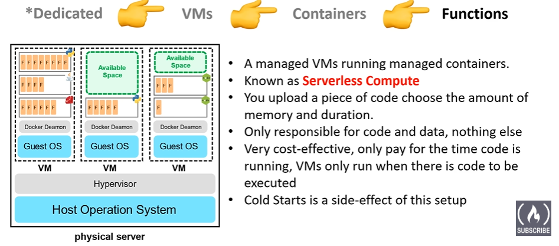
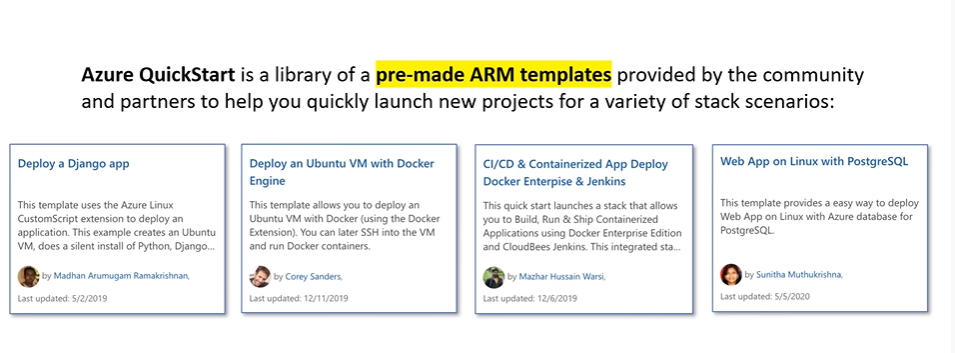
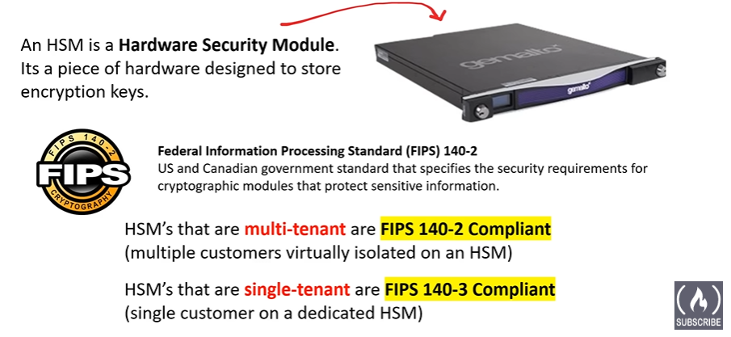
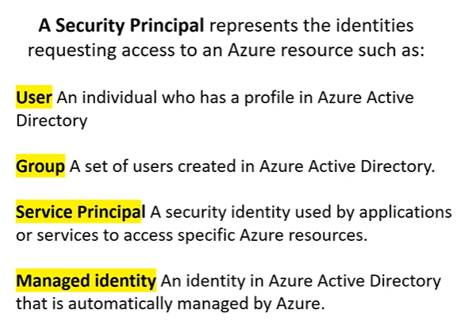
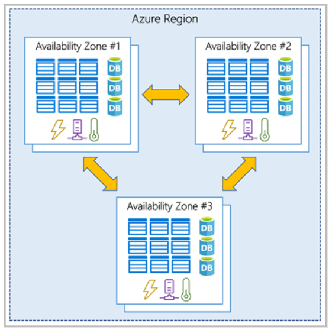
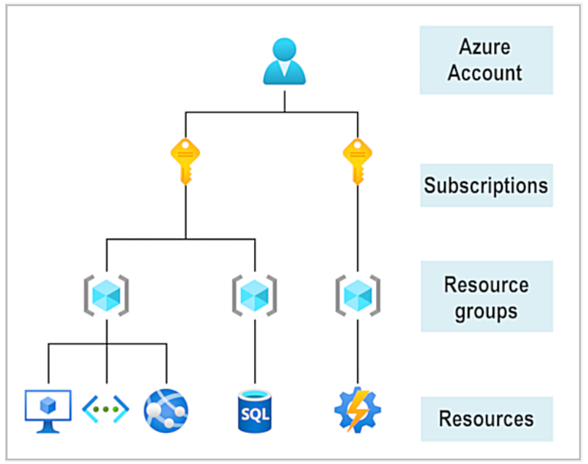
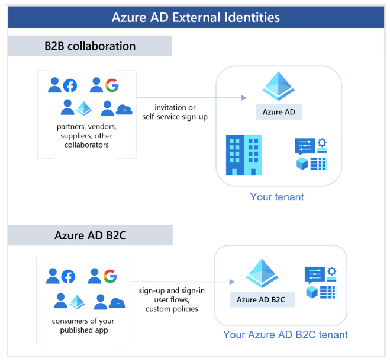
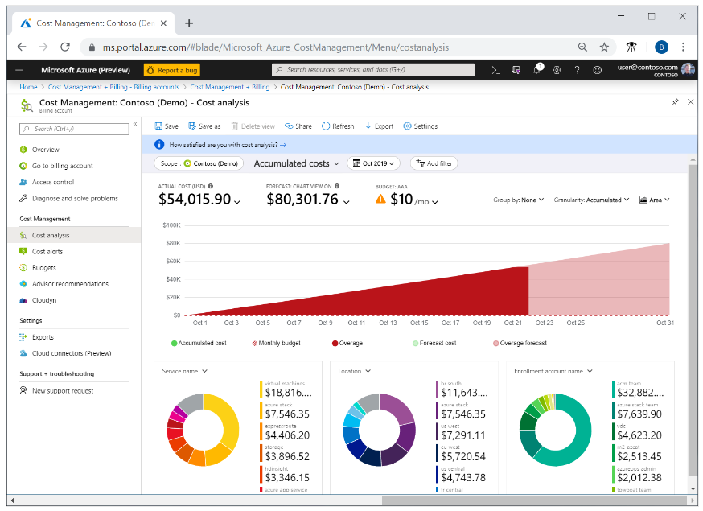

- [Crux](#crux)
- [MISC](#misc)
- [Cloud Conecpts](#cloud-conecpts)
  - [Cloud Computing](#cloud-computing)
  - [Shared Responsibility Model](#shared-responsibility-model)
  - [Cloud Service Types](#cloud-service-types)
    - [IaaS](#iaas)
    - [PaaS](#paas)
    - [SaaS](#saas)
  - [Cloud Models](#cloud-models)
    - [Private](#private)
    - [Public](#public)
    - [Hybrid](#hybrid)
    - [Multi-Cloud](#multi-cloud)
    - [Azure Arc](#azure-arc)
    - [Azure VMware Solution](#azure-vmware-solution)
  - [Consumption Based Model](#consumption-based-model)
  - [Some Terminologies](#some-terminologies)
  - [Benefits of security and governance in the cloud](#benefits-of-security-and-governance-in-the-cloud)
  - [Manageability in the cloud](#manageability-in-the-cloud)
    - [Management of the cloud](#management-of-the-cloud)
    - [Management in the cloud](#management-in-the-cloud)
- [Azure architecture and services](#azure-architecture-and-services)
  - [Core Architectural Components of Azure](#core-architectural-components-of-azure)
    - [Physical Infrastructure](#physical-infrastructure)
      - [Region](#region)
      - [Availability Zones](#availability-zones)
      - [Region Pairs](#region-pairs)
      - [Advantages of Region Pairs](#advantages-of-region-pairs)
      - [Sovereign Regions](#sovereign-regions)
    - [Management Infrastructure](#management-infrastructure)
    - [Azure Acount](#azure-acount)
    - [Ways to manage Azure](#ways-to-manage-azure)
  - [VMs](#vms)
    - [Scale Sets](#scale-sets)
    - [Availability Sets](#availability-sets)
    - [Lift and Shift](#lift-and-shift)
    - [VM Resources](#vm-resources)
  - [Azure Virtual Desktop](#azure-virtual-desktop)
  - [Azure Containers](#azure-containers)
  - [Azure Functions](#azure-functions)
  - [VM vs Container](#vm-vs-container)
  - [Application Hosting Options](#application-hosting-options)
  - [Azure Virtual Networking](#azure-virtual-networking)
  - [Virtual Private Networks](#virtual-private-networks)
  - [VPN Gateway](#vpn-gateway)
    - [High-availability scenarios](#high-availability-scenarios)
    - [Express Route](#express-route)
      - [Features and benefits of ExpressRoute](#features-and-benefits-of-expressroute)
      - [Connectivity to Microsoft cloud services](#connectivity-to-microsoft-cloud-services)
      - [Global connectivity](#global-connectivity)
      - [Dynamic routing](#dynamic-routing)
      - [Built-in redundancy](#built-in-redundancy)
      - [ExpressRoute connectivity models](#expressroute-connectivity-models)
      - [Co-location at a cloud exchange](#co-location-at-a-cloud-exchange)
      - [Point-to-point Ethernet connection](#point-to-point-ethernet-connection)
      - [Any-to-any networks](#any-to-any-networks)
      - [Directly from ExpressRoute sites](#directly-from-expressroute-sites)
      - [Security considerations](#security-considerations)
  - [Azure DNS](#azure-dns)
    - [Benefits of Azure DNS](#benefits-of-azure-dns)
    - [Reliability and performance](#reliability-and-performance)
    - [Security](#security)
    - [Ease of Use](#ease-of-use)
    - [Customizable virtual networks with private domains](#customizable-virtual-networks-with-private-domains)
    - [Alias records](#alias-records)
  - [Azure Storage Accounts](#azure-storage-accounts)
    - [Storage Account Endpoints](#storage-account-endpoints)
    - [Azure storage redundancy](#azure-storage-redundancy)
      - [Redundancy in the primary region](#redundancy-in-the-primary-region)
        - [Locally redundant storage](#locally-redundant-storage)
        - [Zone-redundant storage](#zone-redundant-storage)
      - [Redundancy in the secondary region](#redundancy-in-the-secondary-region)
        - [Geo-redundant storage](#geo-redundant-storage)
        - [Geo-zone-redundant storage](#geo-zone-redundant-storage)
      - [Read access to data in the secondary region](#read-access-to-data-in-the-secondary-region)
    - [Azure storage services](#azure-storage-services)
      - [Blob Storage](#blob-storage)
        - [Blob storage tiers](#blob-storage-tiers)
      - [Azure Files](#azure-files)
        - [Azure Files key benefits:](#azure-files-key-benefits)
      - [Queue Storage](#queue-storage)
      - [Azure Disks](#azure-disks)
    - [Azure data migration options](#azure-data-migration-options)
      - [Azure Migrate](#azure-migrate)
        - [Integrated tools](#integrated-tools)
      - [Azure Databox](#azure-databox)
        - [Use Cases](#use-cases)
    - [Azure file movement options](#azure-file-movement-options)
      - [AzCopy](#azcopy)
      - [Azure Storage Explorer](#azure-storage-explorer)
      - [Azure File Sync](#azure-file-sync)
  - [Azure identity, access, and security](#azure-identity-access-and-security)
    - [Azure directory services, Azure Active Directory](#azure-directory-services-azure-active-directory)
      - [Who uses Azure AD](#who-uses-azure-ad)
      - [What does Azure AD do?](#what-does-azure-ad-do)
      - [Connecting on-premises AD with Azure AD](#connecting-on-premises-ad-with-azure-ad)
      - [Azure Active Directory Domain Services](#azure-active-directory-domain-services)
        - [How does it work](#how-does-it-work)
      - [Is information synchronized?](#is-information-synchronized)
    - [Azure authentication methods](#azure-authentication-methods)
      - [SSO](#sso)
      - [Multifactor Authentication](#multifactor-authentication)
        - [Azure AD Multi-Factor Authentication](#azure-ad-multi-factor-authentication)
      - [passwordless authentication](#passwordless-authentication)
        - [Windows Hello for Business](#windows-hello-for-business)
        - [Microsoft Authenticator App](#microsoft-authenticator-app)
        - [FIDO2 security keys](#fido2-security-keys)
    - [Azure external identities](#azure-external-identities)
    - [Azure conditional access](#azure-conditional-access)
      - [When can I use Conditional Access?](#when-can-i-use-conditional-access)
    - [Azure role-based access control](#azure-role-based-access-control)
      - [How is role-based access control applied to resources?](#how-is-role-based-access-control-applied-to-resources)
      - [How is Azure RBAC enforced?](#how-is-azure-rbac-enforced)
    - [Zero Trust Model](#zero-trust-model)
      - [Adjusting to Zero Trust](#adjusting-to-zero-trust)
    - [Defence in depth](#defence-in-depth)
      - [Layers of defense-in-depth](#layers-of-defense-in-depth)
    - [MS Denender for Cloud](#ms-denender-for-cloud)
      - [Protection everywhere you’re deployed](#protection-everywhere-youre-deployed)
      - [Azure-native protections](#azure-native-protections)
      - [Defend your hybrid resources](#defend-your-hybrid-resources)
      - [Defend resources running on other clouds](#defend-resources-running-on-other-clouds)
      - [Assess, Secure, and Defend](#assess-secure-and-defend)
        - [Continuously assess](#continuously-assess)
        - [Secure](#secure)
        - [Defend](#defend)
      - [Security alerts](#security-alerts)
      - [Advanced threat protection](#advanced-threat-protection)
- [Azure management and governance](#azure-management-and-governance)
  - [Cost Management in Azure](#cost-management-in-azure)
    - [factors that can affect costs in Azure](#factors-that-can-affect-costs-in-azure)
      - [Resource Type](#resource-type)
      - [Consumption](#consumption)
      - [Maintenance](#maintenance)
      - [Geography](#geography)
        - [Network Traffic](#network-traffic)
      - [Subscription type](#subscription-type)
      - [Azure Marketplace](#azure-marketplace)
    - [Pricing and Total Cost of Ownership calculators](#pricing-and-total-cost-of-ownership-calculators)
      - [Pricing Calculator](#pricing-calculator)
      - [TCO Calculator](#tco-calculator)
    - [Azure Cost Management tool](#azure-cost-management-tool)
      - [What is Cost Management?](#what-is-cost-management)
      - [Cost alerts](#cost-alerts)
      - [Budget alerts](#budget-alerts)
      - [Credit alerts](#credit-alerts)
      - [Department spending quota alerts](#department-spending-quota-alerts)
      - [Budgets](#budgets)
    - [Purpose of Tags](#purpose-of-tags)
  - [Features and tools in Azure for governance and compliance](#features-and-tools-in-azure-for-governance-and-compliance)
    - [Azure Blueprints](#azure-blueprints)
      - [What are artifacts?](#what-are-artifacts)
      - [How do Azure Blueprints help monitor deployments?](#how-do-azure-blueprints-help-monitor-deployments)
    - [Azure Policy](#azure-policy)
      - [How does Azure Policy define policies?](#how-does-azure-policy-define-policies)
      - [Azure Policy initiatives](#azure-policy-initiatives)
    - [resource locks](#resource-locks)
      - [Types](#types)
      - [How do I manage resource locks?](#how-do-i-manage-resource-locks)
      - [How do I delete or change a locked resource?](#how-do-i-delete-or-change-a-locked-resource)
    - [Service Trust portal](#service-trust-portal)
  - [features and tools for managing and deploying Azure resources](#features-and-tools-for-managing-and-deploying-azure-resources)
    - [Azure portal](#azure-portal)
    - [Azure Cloud Shell](#azure-cloud-shell)
      - [Azure Power Shell](#azure-power-shell)
      - [Azure CLI Shell](#azure-cli-shell)
    - [Azure ARC](#azure-arc-1)
      - [What can Azure Arc do outside of Azure?](#what-can-azure-arc-do-outside-of-azure)
    - [Azure Resource Manager and Azure ARM templates](#azure-resource-manager-and-azure-arm-templates)
      - [Benefits](#benefits)
      - [ARM templates](#arm-templates)
        - [Benefits of using ARM templates](#benefits-of-using-arm-templates)
  - [Management and Governance](#management-and-governance)
    - [Azure Advisor](#azure-advisor)
    - [Azure Service Health](#azure-service-health)
    - [Azure Monitor](#azure-monitor)
      - [Azure Log Analytics](#azure-log-analytics)
      - [Azure Monitor Alerts](#azure-monitor-alerts)
      - [Application Insights](#application-insights)
- [DD](#dd)
  - [Availibility Set](#availibility-set)
    - [How Availibility Sets work?](#how-availibility-sets-work)

# Crux
- IaaS is most flexible
- responsibility always retained by customer
  - Information and data
  - Devices
  - Accounts and Identities
- Shared responsibilities
  - SaaS
    - Identity and directory infrastructure
  - PaaS
    - Identity and directory infrastructure
    - Applications
    - Network Controls
- IaaS for Lift-and-shift migration
- PaaS
  - you don't have to worry about the licensing or patching for operating systems and databases.
  - provides a framework
  - Analytics or business intelligence
- Private Cloud
  - May be hosted onsite or offsite even by a third party that has dedicated that datacenter to your company
- Azure VMware solution
  - Azure VMware Solution lets you run your VMware workloads in Azure with seamless integration and scalability
- Management of the cloud is your managing cloud resources whereas management in the cloud is by what means (tools i.e. APIs, CLI etc) you manage cloud resources
- Region
  - A region is a geographical area on the planet that contains at least one, but potentially multiple datacenters that are nearby and networked together with a low-latency network
  - Region Agnostic Services:
    - Azure Active Directory
    - Azure Traffic Manager
    - Azure DNS
  - paired with another region within the same geography at least 300 miles away
    - In a one-direction pairing, the Primary region does not provide backup for its secondary region
- Availability Zone
  - physically and logically separated datacenters with their own independent power source, network, and cooling
  - Not all Regions have Availability Zones. Regions that support Availability Zones have a minimum of three separate zones
  - are primarily for VMs, managed disks, load balancers, and SQL databases
- Azure services that support availability zones fall into three categories:
  - Zonal services: you select the zone
  - Zone-redundant services: azure automaically duplicates across zones
  - Non-regional services: resilient to zone-wide outages as well as region-wide outages
- Sovereign Region
  - Sovereign regions are instances of Azure that are isolated from the main instance of Azure
  - You may need to use a sovereign region for compliance or legal purposes
- Resource Group
  - a single resource can only be in one resource group at a time
  - resource groups can't be nested
  - When you apply an action to a resource group, that action will apply to all the resources within the resource group
- Subscriptions
  - unit of management, billing, and scale
  - Similar to how resource groups are a way to logically organize resources, subscriptions allow you to logically organize your resource groups and facilitate billing
  - to define boundaries around Azure products, services, and resources
  - subscription boundaries
    - Billing boudary
    - Access Control Boundary
- Management Group
  - organize subscriptions into containers called management groups and apply governance conditions to the management groups
  - All subscriptions within a management group automatically inherit the conditions applied to the management group
  - Management groups can be nested
  - 10,000 management groups can be supported in a single directory.
  - A management group tree can support up to six levels of depth. This limit doesn't include the root level or the subscription level.
  - Each management group and subscription can support only one parent.
- VM
  - image is a template used to create a VM and may already include an OS and other software
  - You can run multiple VMs on one machine
  - Hypervisor is the software layer that lets you use the VM
  - A physical server shared by multiple customers
  - a portion of space can go to waste due to compartmentalization of physical space
  - VM virtualize the hardware whereas containers virtualize OS
- Scale Sets
  - let you create and manage a group of identical, load-balanced VMs
- Availability Sets
  - Update Domain
    - rebooted at the same time
    - An update group going through the update process is given a 30-minute time to recover before maintenance on the next update domain starts
  - Fault Domain
    - common power source and network switch
    - by default up to three fault domains
- Azure Virtual Desktop
  - VM
  - enables you to use a cloud-hosted version of Windows from any location 
- Container
  - VM can run multiple containers
  - Docker daemon lets you run multiple containers within a VM
- Azure Functions
  - If you build an app using VMs or containers, those resources have to be “running” in order for your app to function
  - With Azure Functions, an event wakes the function, alleviating the need to keep resources provisioned when there are no events
  - stateful (called Durable Functions), a context is passed through the function to track prior activity
- App Service
  - HTTP-based service for hosting web applications, REST APIs, and mobile back ends
  - It supports multiple languages, including .NET, .NET Core, Java, Ruby, Node.js, PHP, or Python. It also supports both Windows and Linux environments
- Azure Virtual Networking
  - Point to site
    - from a computer outside your organization back into your corporate network
  - Site to Site
    - link your on-premises VPN device or gateway to the Azure VPN gateway
  - ExpressRoute
    - provides a dedicated private connectivity to Azure that doesn't travel over the internet 
- Network security groups
  - Azure resources that can contain multiple inbound and outbound security rules
- Network virtual appliances
  - specialized VMs that can be compared to a hardened network appliance. A network virtual appliance carries out a particular network function, such as running a firewall or performing wide area network (WAN) optimization
- VPN Gateway
  - Azure VPN Gateway instances are deployed in a dedicated subnet of the virtual network and enable the following connectivity:
    - site-to-site
      - on-premises datacenters to virtual networks
    - point-to-site
      - individual devices to virtual networks
    - network-to-network
      -  virtual networks to other virtual networks
  - only one VPN gateway in each virtual network
  - VPN Types
    - Policy Based
      - specify statically the IP address of packets that should be encrypted through each tunnel
    - Route-based
      - IPSec tunnels are modeled as a network interface or virtual tunnel interface. IP routing (either static routes or dynamic routing protocols) decides which one of these tunnel interfaces to use
      - preferred connection method for on-premises devices
      - more resilient to topology changes such as the creation of new subnets
  - High Availability
    - Active/Standby
    - Active/Active
    - Express route failover
    - zone redundant gateways
- Express Route
  - lets you extend your on-premises networks into the Microsoft cloud over a private connection
  - This connection is called an ExpressRoute Circuit
  - ExpressRoute connections don't go over the public Internet
  - Global connectivity to Microsoft services across all regions with the ExpressRoute Global Reach
  - Any to any networks
    - Azure integrates with your WAN connection to provide a connection like you would have between your datacenter and any branch offices
- Azure DNS
  - manage DNS records for your Azure services and provide DNS for your external resources as well
  - If the IP address of the underlying resource changes, the alias record set seamlessly updates itself during DNS resolution. The alias record set points to the service instance, and the service instance is associated with an IP address
  - You can't use Azure DNS to buy a domain name
- Azure Storage Accounts
  - unique-in-Azure account name
  - Redundancy options
    - Locally redundant storage (LRS)
      - 11 nines
    - Geo-redundant storage (GRS)
      - 16 nines
    - Read-access geo-redundant storage (RA-GRS)
    - Zone-redundant storage (ZRS)
      - 12 nines
    - Geo-zone-redundant storage (GZRS)
      - 16 nines
    - Read-access geo-zone-redundant storage (RA-GZRS)
  - Types
    - Standard general-purpose v2
      - Blob Storage (including Data Lake Storage), Queue Storage, Table Storage, and Azure Files
      - LRS, GRS, RA-GRS, ZRS, GZRS, RA-GZRS
    - Premium block blobs
        - Blob Storage (including Data Lake Storage)
        - LRS, ZRS
    - Premium file shares
      - Azure Files
      - LRS, ZRS
    - Premium page blobs
      - Page blobs only
      - LRS
    - Endpoints
      - Blob Storage
        - https://[storage-account-name].blob.core.windows.net
      - Data Lake Storage Gen2
        - https://[storage-account-name].dfs.core.windows.net
      - Azure Files
        - https://[storage-account-name].file.core.windows.net
      - Queue Storage
        - https://[storage-account-name].queue.core.windows.net
      - Table Storage
        - https://[storage-account-name].table.core.windows.net
  - Redundancy in Primary region
    - Data in an Azure Storage account is always replicated three times in the primary region
    - Azure Storage offers two options for how your data is replicated in the primary region, locally redundant storage (LRS) and zone-redundant storage (ZRS)
  - Redundancy in secondary region
    - geo-redundant storage (GRS)
      - GRS is similar to running LRS in two regions
    - geo-zone-redundant storage (GZRS)
      - GZRS is similar to running ZRS in the primary region and LRS in the secondary region
  - By default, data in the secondary region isn't available for read or write access unless there's a failover to the secondary region.
  - RPO
    - The interval between the most recent writes to the primary region and the last write to the secondary region is known as the **recovery point objective** (RPO).
    - typically 15 minutes but no SLAs
  - Storage options
    - Blob
      - text and binary
      - includes support for big data analytics through Data Lake Storage Gen2
      - Storing files for distributed access
      - Streaming video and audio
      - Storing data for backup and restore, disaster recovery, and archiving
      - Tiers
        - Hot access
        - Cool access
          - at least 30 day old data
        - Archive access
          - at least 180 days data
          - Archive storage stores data offline and offers the lowest storage costs, but also the highest costs to retrieve and access data
        - Only the hot and cool access tiers can be set at the account level
    - Azure Files
      - accessible via following protocols
        - Server Message Block (SMB)
          - accessible from Windows, Linux, and macOS
          - can be cached on Windows Servers with Azure File Sync
      - Network File System (NFS)
        - accessible from Linux and macOS
    - Queue Storage
      - Each individual message can be up to 64 KB in size
      - commonly used to create a backlog of work to process asynchronously
    - Disks
      - virtualized
- Azure Data Migration
  - supports both real-time migration of infrastructure, applications, and data using
    - Azure Migrate
      - service that helps you migrate from an on-premises environment to the cloud
    - asynchronous migration of data using Azure Data Box
      - 80 TB
  - Integrated tools
      - Discovery and assessment
        - Discover and assess on-premises servers
      - Server Migration
        - Migrate VMware VMs, Hyper-V VMs, physical servers, other virtualized servers, and public cloud VMs to Azure
      - Data Migration Assistant
        - stand-alone tool to assess SQL Servers. It helps pinpoint potential problems blocking migration. It identifies unsupported features, new features that can benefit you after migration, and the right path for database migration
      - Azure Database Migration Service
        - Migrate on-premises databases to Azure
      - Web app migration assistant
- Azure file movement options
  - AzCopy
    - command-line utility
    - With AzCopy, you can upload files, download files, copy files between storage accounts, and even synchronize files
    - AzCopy can even be configured to work with other cloud providers to help move files back and forth between clouds
    - Synchronizing blobs or files with AzCopy is one-direction synchronization
  - Azure Storage Explorer
    - GUI uses AzCopy on the backend
  - Azure File Synx
    - centralize your file shares in Azure Files
    - Once you install Azure File Sync on your local Windows server, it will automatically stay bi-directionally synced with your files in Azure
    - Have as many caches as you need across the world
- Azure Active Directory
  - cloud-based identity and access management service
    - monitor sign in attempts at no extra cost
  - can also help you maintain your on-premises Active Directory deployment
    - here Windows Server is used
    - Microsoft doesn't monitor sign-in attempts
  - do
    - Authentication
    - SSO
    - Application Management
    - Device management
- Azure AD connect
  - connecting Azure AD with your on-premises AD
  - synchronizes user identities between on-premises Active Directory and Azure AD
- [Azure AD Domain Services](#azure-active-directory-domain-services)
- Azure Authentication Methods
  - Passwordless
    - Highly convenient and high security
    - anchor
      - something you have
      - something you are
      - something you know
    - Options
      - Windows Hello for Business
        - ideal for information workers that have their own designated Windows PC
        - biometric and PIN credentials are directly tied to the user's PC
        - public key infrastructure (PKI) integration and built-in support for single sign-on (SSO)
      - Microsoft Authenticator app
        - Users can sign-in to any platform or browser by getting a notification to their phone, matching a number displayed on the screen to the one on their phone, and then using their biometric (touch or face) or PIN to confirm
      - FIDO2 (Fast IDentity Online) security keys
        - latest standard that incorporates the web authentication (WebAuthn)
        - unphishable
        - without a username or password by using an external security key or a platform key built into a device.
        - security keys are typically USB devices, but could also use Bluetooth or NFC
    - Multifactor Authentication
      - Low convenience and high security
    - Password
      - Highly convenient but low security
    - SSO
      - remember only one ID and one password
- Conditional Access
  - During sign-in, Conditional Access collects signals from the user, makes decisions based on those signals, and then enforces that decision by allowing or denying the access request or challenging for a multifactor authentication response
  - You can use conditional access for
    - Require access to services only through approved client applications. For example, you could limit which email applications are able to connect to your email service
- Role Based Access Control (RBAC)
  - principle of least privilege
  - if you hire a new engineer and add them to the Azure RBAC group for engineers, they automatically get the same access as the other engineers in the same Azure RBAC group
  - Azure RBAC is hierarchical, in that when you grant access at a parent scope, those permissions are inherited by all child scopes
  - Role-based access control is applied to a scope, which is a resource or set of resources that this access applies to
  - Scopes include:
    - A management group (a collection of multiple subscriptions)
    - A single subscription
    - A resource group
    - A single resource
- Azure RBAC is enforced on any action that's initiated against an Azure resource that passes through Azure Resource Manager. Resource Manager is a management service that provides a way to organize and secure your cloud resources
- Zero Trust Model
  - security model that assumes the worst case scenario and protects resources with that expectation
  - Principles
    - Verify explicitly
    - Use least privilege access
    - Assume breach
- Defence in depth
  - Layers
    - Physical
    - Identity and Access
    - Perimeter
      - uses distributed denial of service (DDoS) protection
    - Network
      - limits communication between resources through segmentation and access controls
    - Compute
      - Implement endpoint protection
      - keep systems patched and current
    - Application
      - Store sensitive application secrets in a secure storage medium
    - Data
- MS Defender for Cloud
  - monitors your cloud, on-premises, hybrid, and multi-cloud environments to provide guidance and notifications aimed at strengthening your security posture
  - can automatically deploy a Log Analytics agent to gather security-related data
  - Defender plans are extended to non Azure machines with the help of Azure Arc
  - Cloud security posture management (CSPM) features are extended to multi-cloud machines without the need for any agents
  - Defender for Cloud fills three vital needs
    - Continuously assess
    - Secure
    - Defend
  - Defender for Cloud groups the recommendations into security controls and adds a secure score value to each control
- ExpressRoute supports four models that you can use to connect your on-premises network to the Microsoft cloud:
  - CloudExchange colocation
  - Point-to-point Ethernet connection
  - Any-to-any connection
  - Directly from ExpressRoute sites

# MISC

- For all Virtual Machines that have two or more instances deployed across two or more Availability Zones in the same Azure region, we guarantee you will have Virtual Machine Connectivity to at least one instance at least 99.99% of the time.
- For all Virtual Machines that have two or more instances deployed in the same Availability Set or in the same Dedicated Host Group, we guarantee you will have Virtual Machine Connectivity to at least one instance at least 99.95% of the time.
- Hybrid provides greatest degree of flexibility
- To connect to a workspace from an environment outside of the workspace, you should download the config.json file for your workspace from the Azure portal. This includes the subscription and workspace information necessary to connect.
- A PaaS solution that hosts web apps in Azure provides professional development services to continuously add features to custom application
  - PaaS provides a framework that developers can build upon to develop or customize cloud-based applications. PaaS development tools can cut the time it takes to code new apps with pre-coded application components built into the platform, such as workflow, directory services, security features, search and so on.
- When you are implementing a Software as a Service (SaaS) solution, you are responsible for configuring the SaaS solution. Everything else is managed by the cloud provider.
- Azure DevTest Labs is a service for easily creating, using, and managing infrastructure-as-a-service (IaaS) virtual machines (VMs) and platform-as-a-service (PaaS) environments in labs. Labs offer preconfigured bases and artifacts for creating VMs, and Azure Resource Manager (ARM) templates for creating environments like Azure Web Apps or SharePoint farms.
- Key vault encrypt the data
- Azure Information Protection (AIP) is a cloud-based solution which classifies and protects documents and emails in both SharePoint and Outlook
- Azure Government is the mission-critical cloud, delivering breakthrough innovation to US government customers and their partners. Only US federal, state, local, and tribal governments and their partners have access to this dedicated instance, with operations controlled by screened US citizens
- Identity Protection allows organizations to accomplish three key tasks: Automate the detection and remediation of identity-based risks. Investigate risks using data in the portal. Export risk detection data to other tools.
- Privileged Identity Management (PIM) is a service in Azure Active Directory (Azure AD) that enables you to manage, control, and monitor access to important resources in your organization.
- Azure VPN Gateway connects your on-premises networks to Azure through Site-to-Site VPNs in a similar way that you set up and connect to a remote branch office.
- When an Azure virtual machine is stopped, you don't pay for the virtual machine. However, you do still pay for the storage costs associated to the virtual machine.
- Two virtual machines using the same size could have different disk configurations. Therefore, the monthly costs could be different.
- With the public cloud, you have self-service management. You are responsible for the deployment and configuration of the cloud resources such as virtual machines or web sites. The underlying hardware that hosts the cloud resources is managed by the cloud provider.
- Azure App Service and Azure SQL databases are examples of Azure PaaS solutions
- Azure SQL Database is a fully managed Platform as a Service (PaaS) Database Engine that handles most of the database management functions such as upgrading, patching, backups, and monitoring without user involvement
- A hybrid cloud is a combination of a private cloud and a public cloud.
- Capital expenditure is the spending of money up-front for infrastructure such as new servers.
- With a hybrid cloud, you can continue to use the on-premises servers while adding new servers in the public cloud (Azure for example). 
- Adding new servers in Azure minimizes the capital expenditure costs as you are not paying for new servers as you would if you deployed new server on-premises.
- Azure Site Recovery helps ensure business continuity by keeping business apps and workloads running during outages. Site Recovery replicates workloads running on physical and virtual machines (VMs) from a primary site to a secondary location and hence is fault tolerance scenario
- Azure site recovery provides disaster recovery for VMs
- A PaaS doesn't provide additional memory to apps by changing pricing tiers
- A PaaS  solution that hosts web apps in Azure can be provided with additional memory by changing pricing tier
- Azure Cosmos DB is an example of a platform as a service (PaaS) cloud database provider.
- Azure Backup is PaaS
- You can not create a resource group inside another resource group
- sql is paas but if we install it on our own VM then it's IaaS
- Azure Files is IaaS
- Microsoft Intune is SaaS
- x
  - ✑ You must be able to modify the code of App1.
  - ✑ Administrative effort to manage the operating system of App1 must be minimized.
  - ✑ App2 must run interactively with the operating system of the server.
    - App 1 => PaaS
    - App 2 => SaaS
- Cloud Infrastructure-based Applications ג€" It moves your existing on-premises apps to the Infrastructure as a Service (IaaS) platform or re-hosts them. ג€Lift & Shiftג€ is a common term for this type of relocation.
- Azure vNets deployed to the same azure region are connected by default
- Each Azure vNet in a single resource group must have a unique name
- The Azure virtual network's address space must be unique within a subscription
- Availability zones expand the level of control you have to maintain the availability of the applications and data on your VMs. An Availability Zone is a physically separate zone, within an Azure region. There are three Availability Zones per supported Azure region. Each Availability Zone has a distinct power source, network, and cooling. By architecting your solutions to use replicated VMs in zones, you can protect your apps and data from the loss of a datacenter. If one zone is compromised, then replicated apps and data are instantly available in another zone.
- A Local Network Gateway is an object in Azure that represents your on-premise VPN device. A Virtual Network Gateway is the VPN object at the Azure end of the VPN. A 'connection' is what connects the Local Network Gateway and the Virtual Network Gateway to bring up the VPN. The local network gateway typically refers to your on-premises location. You give the site a name by which Azure can refer to it, then specify the IP address of the on-premises VPN device to which you will create a connection. You also specify the IP address prefixes that will be routed through the VPN gateway to the VPN device. The address prefixes you specify are the prefixes located on your on-premises network. If your on-premises network changes or you need to change the public IP address for the VPN device, you can easily update the values later.
- A resource group is a logical container for Azure resources. When you create a resource group, you specify which location to create the resource group in. However, when you create a virtual machine and place it in the resource group, the virtual machine can still be in a different location (different datacenter). Therefore, creating multiple resource groups, even if they are in separate datacenters does not ensure that the services running on the virtual machines are available if a single data center fails.
- An Azure AD tenant can have multiple subscriptions but an Azure subscription can only be associated with one Azure AD tenant.
- You can change the Azure AD Tenant to which Azure Subscription is associated
- If your subscription expires, you lose access to all the other resources associated with the subscription. However, the Azure AD directory remains in Azure. You can associate and manage the directory using a different Azure subscription.
- Azure policies can be used to define requirements for resource properties during deployment and for already existing resources. Azure Policy controls properties such as the types or locations of resources. Azure Policy is a service in Azure that you use to create, assign, and manage policies. These policies enforce different rules and effects over your resources, so those resources stay compliant with your corporate standards and service level agreements. Azure Policy meets this need by evaluating your resources for non- compliance with assigned policies. All data stored by Azure Policy is encrypted at rest. For example, you can have a policy to allow only a certain SKU size of virtual machines in your environment. Once this policy is implemented, new and existing resources are evaluated for compliance. With the right type of policy, existing resources can be brought into compliance.
- To implement a solution that enables the client computers on your on-premises network to communicate to the Azure virtual machines, you need to configure a VPN (Virtual Private Network) to connect the on-premises network to the Azure virtual network. The Azure VPN device is known as a Virtual Network Gateway. The virtual network gateway needs to be located in a dedicated subnet in the Azure virtual network. This dedicated subnet is known as a gateway subnet and must be named 'GatewaySubnet'.
Note: a virtual network (answer D) is also required. However, as we already have virtual machines deployed in a Azure, we can assume that the virtual network is already in place.
- Many Azure resource have quote limits. The purpose of the quota limits is to help you control your Azure costs. However, it is common to require an increase to the default quota. You can request a quota limit increase by opening a support request. In the support request, select 'Service and subscription limits (quotas)' for the Issue type, select your subscription and the service you want to increase the quota for. For this question, you would select 'SQL Database Managed Instance' as the quote type.
- You need an Azure Active Directory account to manage a subscription, not a Microsoft account.
- resource groups do not contain subscriptions. Subscriptions contain resource groups.
- Availability Zones are unique physical locations within a single Azure region.
- which storage service must be used to store the unmanaged data disks of the virtual machine.
  - Containers
    - Scalable cost effective storage for unstructured data
- You plan to map a network drive from several computers that run Windows 10 to Azure Storage. You need to create a storage solution in Azure for the planned mapped drive.
  - a File service in a storage account
- Azure Cosmos DB is Microsoft's globally distributed, multi-model database service. With a click of a button, Cosmos DB enables you to elastically and independently scale throughput and storage across any number of Azure regions worldwide. Azure Cosmos DB is a great way to store unstructured and JSON data
- Tags for Resources are not inherited by default from their Resource Group
- Data in the archive tier can take several hours to retrieve. While a blob is in archive storage, the blob data is offline and can't be read, overwritten, or modified. To read or download a blob in archive, you must first rehydrate it to an online tier.
- Which Azure service should you use to collect events from multiple resources into a centralized repository?
  - Event Hub
- Availability Zones is a high-availability offering that protects your applications and data from datacenter failures. Availability Zones are unique physical locations within an Azure region.
- Data is not backed up automatically to another Azure Data Center although it can be depending on the replication option configured for the account. Locally Redundant Storage (LRS) is the default which maintains three copies of the data in the data center.
- The current storage limit is 2 PB for US and Europe, and 500 TB for all other regions (including the UK) with no limit on the number of files.
- Not all Azure regions support availability zones.
- Regions that support availability zones support Linux virtual machines.
- North America has several Azure regions, including West US, Central US, South Central US, East Us, and Canada East.
- Outbound data transfer is charged at the normal rate and inbound data transfer is free.
- IoT Hub
  - Managed service that provides bidirectional communication between IoT devices and Azure
- IoT Central
  - SaaS to connect monitor and manage IoT devices
- Azure Sphere
  - Software and hardware solution that provides communication and security features for IoT devices
- Windows virtual desktop
  - For Max session limit, enter the maximum number of users you want load-balanced to a single session host
- You can use AZ to protect Azure VMs and managed disks from a datacenter failure
- There can only be one Service Administrator per Azure subscription
- Do I need a Microsoft account to sign up for Azure? You can sign up with either a Microsoft account or a GitHub account.
- Users in Azure AD are not organized by using resource groups
- Azure AD groups support dynamic membership rules
- Azure automatically routes traffic between subnets in a virtual network. Therefore, all virtual machines in a virtual network can connect to the other virtual machines in the same virtual network. Even if the virtual machines are on separate subnets within the virtual network, they can still communicate with each other. To ensure that a virtual machine cannot connect to the other virtual machines, the virtual machine must be deployed to a separate virtual network.
- Azure HDInsight
  - Managed Apache Hadoop clusters in the cloud that enable you to process massive amounts of data
- Only the hot and cool access tiers can be set at the account level. The archive access tier can only be set at the blob level
- Executes Code - Azure Functions
- Is Stateful - Azure Logic Apps
- Runs only in cloud - Azure Logic Apps
- Your company has an Azure subscription that contains resources in several regions. You need to ensure that administrators can only create resources in those regions.
  - Azure Policy
- The Azure File Sync agent enables data on a Windows Server to be synchronized with an Azure File share.
- Cloud based accounting system => SaaS
- Cloud based service for custom apps => PaaS
- Cloud based file server => IaaS
- With a resource group, you can allow a user to manage all resources in the resource group, such as virtual machines, websites, and subnets. The permissions you apply to the resource group apply to all resources contained in the resource group.
- By deploying the virtual machines to two or more regions or even AZs, you are deploying the virtual machines to multiple datacenters. This will ensure that the services running on the virtual machines are available if a single data center fails. 
- An Azure container instance is an example of an Azure compute service
- At which OSI layer does ExpressRoute operate?
  - 3
- Application Insights is a feature of Azure Monitor that provides extensible application performance management (APM) and monitoring for live web apps.
- Azure PowerShell requires Windows PowerShell to function. Azure CLI can't execute any powershell scripts.
- With the Azure Cloud Shell, you can run PowerShell cmdlets and scripts in a Web browser. 
- Azure Service Health consists of three components: Azure Status, Azure Service Heath and Azure Resource Health. Azure service health provides a personalized view of the health of the Azure services and regions you're using. This is the best place to look for service impacting communications about outages, planned maintenance activities, and other health advisories because the authenticated Azure Service Health experience knows which services and resources you currently use. To view the health of all other services available in Azure, you would use the Azure Status component of Azure Service Health. Azure status informs you of service outages in Azure on the Azure Status page. The page is a global view of the health of all Azure services across all Azure regions.
- Azure Application Insights detects and diagnoses anomalies in web apps.
- Azure Monitor is used to monitor the health of Azure services. Azure Monitor maximizes the availability and performance of your applications and services by delivering a comprehensive solution for collecting, analyzing, and acting on telemetry from your cloud and on-premises environments. It helps you understand how your applications are performing and proactively identifies issues affecting them and the resources they depend on.
- You can browse available virtual machine images in the Azure Marketplace.
- With Azure Cloud Shell, you can create virtual machines using Bash or PowerShell.
  - Azure Cloud Shell is an interactive, authenticated, browser-accessible shell for managing Azure resources. It provides the flexibility of choosing the shell experience that best suits the way you work, either Bash or PowerShell.
- Azure Logic Apps is a cloud service that helps you schedule, automate, and orchestrate tasks, business processes, and workflows when you need to integrate apps, data, systems, and services across enterprises or organizations.
- The question states that users are located worldwide and will be downloading large video files. The video playback experience would be improved if they can download the video from servers in the same region as the users. We can achieve this by using a content deliver network.
A content delivery network (CDN) is a distributed network of servers that can efficiently deliver web content to users. CDNs store cached content on edge servers in point-of-presence (POP) locations that are close to end users, to minimize latency.
- The Azure portal is the web-based portal for managing Azure. Being web-based, you can use the Azure portal on an iPhone. Azure Cloud Shell is a web-based command line for managing Azure. You access the Azure Cloud Shell from the Azure portal. Being web-based, you can use the Azure Cloud Shell on an iPhone.
- There is no requirement to implement the security recommendations provided by Azure Advisor. The recommendations are just that, 'recommendations'. They are not 'requirements'.
- What can you use to automatically send an alert if an administrator stops an Azure virtual machine?
  - Monitor
- Azure Advisor does not provide recommendations on how to configure network settings on Azure virtual machines.
- Azure Advisor does not provide recommendations on how to improve the security of an Azure AD environment.
- Advisor helps you optimize and reduce your overall Azure spend by identifying idle and underutilized resources. You can get cost recommendations from the Cost tab on the Advisor dashboard.
- The command can be run from PowerShell or the command prompt if you have the Azure CLI installed.
- Previously, the Azure CLI (or x-plat CLI) was the only option for managing Azure subscriptions and resources from the command-line on Linux and macOS. Now with the open source and cross-platform release of PowerShell, you'll be able to manage all your Azure resources from Windows, Linux and macOS using your tool of choice, either the Azure CLI or Azure PowerShell cmdlets.
The Azure portal runs in a web browser so can be used in either operating system.
- Azure Resource Manager templates provides a common platform for deploying objects to a cloud infrastructure and for implementing consistency across the Azure environment.

<!-- # Basics

## Cloud Compting
- The practice of using a network of remote servers hosted on the Internet to store, manage, and process data, rather than a local server or a personal computer.

## On-Premise
- Local = On-Premise
  - You own the servers 
  - You hire the IT people
  - You pay or rent the real-estate
  - You take all the risk

## Ways you can get computing resources

## Common Cloud Services

## Benefits of Cloud Computing

## Types of Cloud Computing

## Types of Cloud Computing Responsibilities and who are responsible

## Azure Deployment Models

## Cross Cloud

- Using multiple cloud providers aka multi-cloud, hybrid cloud.
- E.g. Azure Arc extends your control plane, so you can run Kubernetes containers on different platforms, and all are treated as if they are running on the same network.

## TCO, Total Cost of Ownership

## CAPEX vs OPEX

## Cloud Terminologies

- Availibility zone
  - What Azure call datacenters

### High Availability

### High Scalability

### High Elasticity

#### How it differs from Scalability
It is automatic.

### High Durability

# Evolution of Computing

# Global Infrastructure

## Region and Geography

## Paird Regions

## Region Types and Service Availability

## Special Regions

## Availability Zone

## AZ Supported Regions

## Fault and Update Domain

### How to create default and update domains in Azure

- While creating VM
  - Under `Availibilty` options choose `Availibility Set`
  - Click `create new` under `Availibility Set`
    - A screen will appear, name your `Availibility Set` and decide number of `Fault domains` and `Update domains`
      - lets say if you chose **N** `Fault domains` then **N** of the VMs will be in **N** different racks, so that if one goes down then others would still be running
      - Update domains represent groups of virtual machines and underlying physical hardware that can be rebooted at the same time
      - You can also select if you want `managed disks` or not

# Azure Services

## Computing Services

## Storage Services

## Database Services

## Application Integration Services

## Developer and Mobile tools

## DevOps tools

## Resource Manager

## QuickStart Templates

## Networking

### Enterprise/Hybrid Networking Services

### Cloud-Native Networking Services

#### vNet and Subnet

#### Traffic Manager

#### DNS

#### Load Balancer

## Elasticity

### Scale Sets

## IoT

## Big Data and Analytics

## AI/ML

## Serverless

# Azure Portal and Preview Portal

# Azure Management Tools

## PowerShell

## Cloud Shell

## Azure CLI

## VS Code

# Follow Alongs

## Creating Resource Group

- [Youtube](https://www.youtube.com/watch?v=NKEFWyqJ5XA&t=6843s)

## Create a vNet

- [Youtube](https://www.youtube.com/watch?v=NKEFWyqJ5XA&t=6843s)

## Launching a server

## Launching a server

- [Youtube](https://www.youtube.com/watch?v=NKEFWyqJ5XA&t=7106s)

## Creating a Azure Function

- [Youtube](Exploring Azure Cloud Shell)

## Storing files in Blob Storage

- [Youtube](https://www.youtube.com/watch?v=NKEFWyqJ5XA&t=7724s)

## Exploring Azure Cloud Shell

- [Youtube](https://www.youtube.com/watch?v=NKEFWyqJ5XA&t=7928s)

# Security

## Azure Trust Cente

## Azure Compliance Plans

## Azure Active Directory

## Multi-Factor Authentication

## Azure Security Center

## Key Vault

## Azure DDoS Protection

## Azure Firewall

## Azure Information Protection (AIP)

## Application Gateway

## Advanced Threat Protection (ATP)

## Microsoft Security Development Lifecycle (SDL)

## Azure Security - Policies

## Role-Based Access Control (RBAC)

## Lock resources

## Azure Management Groups

## Azure Monitor

## Service Health

## Azure Advisor

## Billing and Pricing

### Service Level Agreements

### Pricing and Support - SLAs

### Pricing and Support - Composite SLA

### Pricing and Support - TCO Calculator

- [Youtube](https://www.youtube.com/watch?v=NKEFWyqJ5XA&t=10190s)

### Service Credits

### Azure Marketplace

- [Youtube](https://www.youtube.com/watch?v=NKEFWyqJ5XA&t=10354s)

### Azure Support

- [Youtube](https://www.youtube.com/watch?v=NKEFWyqJ5XA&t=10461s)

### Azure Licensing

- [Youtube](https://www.youtube.com/watch?v=NKEFWyqJ5XA&t=10802s)

### Azure Subscriptions

- [Youtube](https://www.youtube.com/watch?v=NKEFWyqJ5XA&t=10923s)

### Azure Pricing Calculator

- [Youtube](https://www.youtube.com/watch?v=NKEFWyqJ5XA&t=11055s)

### Azure Cost Management

- [Youtube](https://www.youtube.com/watch?v=NKEFWyqJ5XA&t=11201s)

# Official Source -->

# Cloud Conecpts

## Cloud Computing
- Cloud computing is the delivery of computing services over the internet

## Shared Responsibility Model
With the shared responsibility model, these responsibilities get shared between the cloud provider and the consumer.

- Infrastructure as a service (IaaS) is the most flexible category of cloud services

## Cloud Service Types

### IaaS

**Use Case:**
- Lift-and-shift migration: You’re standing up cloud resources similar to your on-prem datacenter, and then simply moving the things running on-prem to running on the IaaS infrastructure.
- Testing and development: You have established configurations for development and test environments that you need to rapidly replicate. You can stand up or shut down the different environments rapidly with an IaaS structure, while maintaining complete control.

### PaaS

- In a PaaS scenario, you don't have to worry about the licensing or patching for operating systems and databases.

**Use Case:**
- Development framework: PaaS provides a framework that developers can build upon to develop or customize cloud-based applications. Similar to the way you create an Excel macro, PaaS lets developers create applications using built-in software components. Cloud features such as scalability, high-availability, and multi-tenant capability are included, reducing the amount of coding that developers must do.
- Analytics or business intelligence: Tools provided as a service with PaaS allow organizations to analyze and mine their data, finding insights and patterns and predicting outcomes to improve forecasting, product design decisions, investment returns, and other business decisions.

### SaaS
- most complete cloud service model from a product perspective

**Use Case:**
- Email and messaging.
- Business productivity applications.
- Finance and expense tracking.

## Cloud Models

### Private 

- used by a single entity
- provides much greater control
- greater cost and fewer of the benefits of a public cloud deployment
- May be hosted onsite or offsite even by a third party that has dedicated that datacenter to your company.

### Public

-  built, controlled, and maintained by a third-party cloud provider

### Hybrid
- The hybrid cloud model is a combination of public cloud and private cloud, using both datacenters dedicated solely to one customer and datacenters that are shared with the public.
- computing environment that uses both public and private clouds in an inter-connected environment. 
- A hybrid cloud environment can be used to allow a private cloud to surge for increased, temporary demand by deploying public cloud resources. 
- Hybrid cloud can be used to provide an extra layer of security. 
- For example, users can flexibly choose which services to keep in public cloud and which to deploy to their private cloud infrastructure.

### Multi-Cloud
- you use multiple public cloud providers

### Azure Arc
- set of technologies that helps manage your cloud environment. 
- can help manage your cloud environment, whether it's a public cloud solely on Azure, a private cloud in your datacenter, a hybrid configuration, or even a multi-cloud environment running on multiple cloud providers at once.

### Azure VMware Solution
What if you’re already established with VMware in a private cloud environment but want to migrate to a public or hybrid cloud? Azure VMware Solution lets you run your VMware workloads in Azure with seamless integration and scalability.

## Consumption Based Model

two types of expenses to consider. 
- Capital expenditure (CapEx) 
- operational expenditure (OpEx).

## Some Terminologies

- Availability
- Scalability
  - Vertical
    - Scale Up
      - upgrade to bigger server
    - Scale Down
  - Horizontal
    - Scale Out
      - add more servers of same size
    - Scale In
      - remove servers
- Elasticity
- Fault Tolerance
- Disaster Recovery / Reliability
  - Reliability is the ability of a system to recover from failures and continue to function
- Predictability
  - Performance
    - predicting the resources needed to deliver a positive experience for your customers
    - Autoscaling, load balancing, and high availability are just some of the cloud concepts that support performance predictability
  - Cost
    - By operating in the cloud and using cloud analytics and information, you can predict future costs and adjust your resources as needed. You can even use tools like the Total Cost of Ownership (TCO) or Pricing Calculator to get an estimate of potential cloud spend

## Benefits of security and governance in the cloud
- Things like set templates help ensure that all your deployed resources meet corporate standards and government regulatory requirements
- you can update all your deployed resources to new standards as standards change
- Cloud-based auditing helps flag any resource that’s out of compliance with your corporate standards and provides mitigation strategies
- Depending on your operating model, software patches and updates may also automatically be applied, which helps with both governance and security
- On the security side, you can find a cloud solution that matches your security needs. If you want maximum control of security, infrastructure as a service provides you with physical resources but lets you manage the operating systems and installed software, including patches and maintenance. If you want patches and maintenance taken care of automatically, platform as a service or software as a service deployments may be the best cloud strategies for you.

## Manageability in the cloud

### Management of the cloud
Management of the cloud speaks to managing your cloud resources. In the cloud, you can:

- Automatically scale resource deployment based on need.
- Deploy resources based on a preconfigured template, removing the need for manual configuration.
- Monitor the health of resources and automatically replace failing resources.
- Receive automatic alerts based on configured metrics, so you’re aware of performance in real time.

### Management in the cloud
Management in the cloud speaks to how you’re able to manage your cloud environment and resources. You can manage these:

- Through a web portal.
- Using a command line interface.
- Using APIs.
- Using PowerShell.

# Azure architecture and services

## Core Architectural Components of Azure

The core architectural components of Azure may be broken down into two main groupings: 
- the physical infrastructure 
- the management infrastructure

### Physical Infrastructure
- datacenters
-  these individual datacenters aren’t directly accessible. 
-  Datacenters are grouped into Azure Regions or Azure Availability Zones that are designed to help you achieve resiliency and reliability for your business-critical workloads.

#### Region
- A region is a geographical area on the planet that contains at least one, but potentially multiple datacenters that are nearby and networked together with a low-latency network

> Some services or virtual machine (VM) features are only available in certain regions, such as specific VM sizes or storage types. There are also some global Azure services that don't require you to select a particular region, such as Azure Active Directory, Azure Traffic Manager, and Azure DNS.

#### Availability Zones
- Availability zones are physically separate datacenters within an Azure region
- Each availability zone is made up of one or more datacenters equipped with independent power, cooling, and networking 
- An availability zone is set up to be an isolation boundary. If one zone goes down, the other continues working
- Availability zones are connected through high-speed, private fiber-optic networks

> To ensure resiliency, a minimum of three separate availability zones are present in all availability zone-enabled regions. However, not all Azure Regions currently support availability zones.

- use availability zones to run mission-critical applications and build high-availability into your application architecture by co-locating your compute, storage, networking, and data resources within an availability zone and replicating in other availability zones. 
- Keep in mind that there could be a cost to duplicating your services and transferring data between availability zones

Availability zones are primarily for VMs, managed disks, load balancers, and SQL databases. Azure services that support availability zones fall into three categories:

- Zonal services: You pin the resource to a specific zone (for example, VMs, managed disks, IP addresses).
- Zone-redundant services: The platform replicates automatically across zones (for example, zone-redundant storage, SQL Database).
- Non-regional services: Services are always available from Azure geographies and are resilient to zone-wide outages as well as region-wide outages.

#### Region Pairs

- Most Azure regions are paired with another region within the same geography (such as US, Europe, or Asia) at least 300 miles away
- Examples of region pairs in Azure are West US paired with East US and South-East Asia paired with East Asia
- If one of the regions were to experience a disaster or failure, then the services in that region will automatically failover to that regions secondary region in the pair
- Since each Azure Region in an Azure Region Pair are directly connected to each other and the are far enough apart to be isolated from regional disasters, it is recommended by Microsoft that when replicating data or interacting with services across regions that you use Region Pairs.

> Most regions are paired in two directions, meaning they are the backup for the region that provides a backup for them (West US and East US back each other up). However, some regions, such as West India and Brazil South, are paired in only one direction. In a one-direction pairing, the Primary region does not provide backup for its secondary region. So, even though West India’s secondary region is South India, South India does not rely on West India. West India's secondary region is South India, but South India's secondary region is Central India. Brazil South is unique because it's paired with a region outside of its geography. Brazil South's secondary region is South Central US. The secondary region of South Central US isn't Brazil South.

#### Advantages of Region Pairs
- If an extensive Azure outage occurs, one region out of every pair is prioritized to make sure at least one is restored as quickly as possible for applications hosted in that region pair.
- Planned Azure updates are rolled out to paired regions one region at a time to minimize downtime and risk of application outage.
- Data continues to reside within the same geography as its pair (except for Brazil South) for tax- and law-enforcement jurisdiction purposes.

#### Sovereign Regions
- Sovereign regions are instances of Azure that are isolated from the main instance of Azure
- You may need to use a sovereign region for compliance or legal purposes

Azure sovereign regions include:

- US DoD Central, US Gov Virginia, US Gov Iowa and more: These regions are physical and logical network-isolated instances of Azure for U.S. government agencies and partners. These datacenters are operated by screened U.S. personnel and include additional compliance certifications.
- China East, China North, and more: These regions are available through a unique partnership between Microsoft and 21Vianet, whereby Microsoft doesn't directly maintain the datacenters.

### Management Infrastructure

-  resources
   -  Anything you create, provision, deploy, etc. is a resource
-  resource groups
   -  When you create a resource, you’re required to place it into a resource group
   -  While a resource group can contain many resources, a single resource can only be in one resource group at a time
   -  resources may be moved between resource groups
   -  resource groups can't be nested
   -   When you apply an action to a resource group, that action will apply to all the resources within the resource group
       -   If you delete a resource group, all the resources will be deleted
       -   If you grant or deny access to a resource group, you’ve granted or denied access to all the resources within the resource group
-  subscriptions
   -  unit of management, billing, and scale
   -  Similar to how resource groups are a way to logically organize resources, subscriptions allow you to logically organize your resource groups and facilitate billing

   - Using Azure requires an Azure subscription
   - A subscription provides you with authenticated and authorized access to Azure products and services
   - It also allows you to provision resources. An Azure subscription links to an Azure account, which is an identity in Azure Active Directory (Azure AD) or in a directory that Azure AD trusts
   - An account can have multiple subscriptions
   - In a multi-subscription account, you can use the subscriptions to configure different billing models and apply different access-management policies
   - You can use Azure subscriptions to define boundaries around Azure products, services, and resources
   - There are two types of subscription boundaries that you can use
     - Billing Boundary
       - determines how an Azure account is billed for using Azure.
     - Access Control Boundary
       - applies access-management policies at the subscription level, and you can create separate subscriptions to reflect different organizational structures. An example is that within a business, you have different departments to which you apply distinct Azure subscription policies. This billing model allows you to manage and control access to the resources that users provision with specific subscriptions
   - Additional Subscriptions
     - Environments: You can choose to create subscriptions to set up separate environments for development and testing, security, or to isolate data for compliance reasons. This design is particularly useful because resource access control occurs at the subscription level.
     - Organizational structures: You can create subscriptions to reflect different organizational structures. For example, you could limit one team to lower-cost resources, while allowing the IT department a full range. This design allows you to manage and control access to the resources that users provision within each subscription.
     - Billing: You can create additional subscriptions for billing purposes. Because costs are first aggregated at the subscription level, you might want to create subscriptions to manage and track costs based on your needs. For instance, you might want to create one subscription for your production workloads and another subscription for your development and testing workloads.
- Management Groups
  - organize subscriptions into containers called management groups and apply governance conditions to the management groups
  - All subscriptions within a management group automatically inherit the conditions applied to the management group
  - Management groups can be nested
-  accounts

Some examples of how you could use management groups might be:

- **Create a hierarchy that applies a policy.** You could limit VM locations to the US West Region in a group called Production. This policy will inherit onto all the subscriptions that are descendants of that management group and will apply to all VMs under those subscriptions. This security policy can't be altered by the resource or subscription owner, which allows for improved governance.
- **Provide user access to multiple subscriptions.** By moving multiple subscriptions under a management group, you can create one Azure role-based access control (Azure RBAC) assignment on the management group. Assigning Azure RBAC at the management group level means that all sub-management groups, subscriptions, resource groups, and resources underneath that management group would also inherit those permissions. One assignment on the management group can enable users to have access to everything they need instead of scripting Azure RBAC over different subscriptions.

Important facts about management groups:

- 10,000 management groups can be supported in a single directory.
- A management group tree can support up to six levels of depth. This limit doesn't include the root level or the subscription level.
- Each management group and subscription can support only one parent.

### Azure Acount

- your company might use a single Azure account for your business and separate subscriptions for development, marketing, and sales departments

### Ways to manage Azure
- Powershell
- Bash
- Azure CLI Interactive Mode
- Portal

## VMs
- provide IaaS in the form of a virtualized server
- VMs are an ideal choice when you need:
  - Total control over the operating system (OS)
  - To use custom hosting configurations
- You can even create or use an already created image
  - image is a template used to create a VM and may already include an OS and other software, like development tools or web hosting environments

### Scale Sets
- let you create and manage a group of identical, load-balanced VMs
- Scale sets allow you to centrally manage, configure, and update a large number of VMs in minutes
- The number of VM instances can automatically increase or decrease in response to demand, or you can set it to scale based on a defined schedule
- Virtual machine scale sets also automatically deploy a load balancer to make sure that your resources are being used efficiently

### Availability Sets

- **Update domain:** The update domain groups VMs that can be rebooted at the same time. This allows you to apply updates while knowing that only one update domain grouping will be offline at a time. All of the machines in one update domain will be updated. An update group going through the update process is given a 30-minute time to recover before maintenance on the next update domain starts.
- **Fault domain:** The fault domain groups your VMs by common power source and network switch. By default, an availability set will split your VMs across up to three fault domains. This helps protect against a physical power or networking failure by having VMs in different fault domains (thus being connected to different power and networking resources).

### Lift and Shift
VMs are also an excellent choice when you move from a physical server to the cloud (also known as lift and shift). You can create an image of the physical server and host it within a VM with little or no changes. Just like a physical on-premises server, you must maintain the VM: you’re responsible for maintaining the installed OS and software

### VM Resources

When you provision a VM, you’ll also have the chance to pick the resources that are associated with that VM, including:

- Size (purpose, number of processor cores, and amount of RAM)
- Storage disks (hard disk drives, solid state drives, etc.)
- Networking (virtual network, public IP address, and port configuration)

## Azure Virtual Desktop
- Another type of virtual machine
- desktop and application virtualization service that runs on the cloud
- It enables you to use a cloud-hosted version of Windows from any location
- works across devices and operating systems, and works with apps that you can use to access remote desktops or most modern browsers
- provides centralized security management for users' desktops with Azure Active Directory (Azure AD). You can enable multifactor authentication to secure user sign-ins
- You can also secure access to data by assigning granular role-based access controls (RBACs) to users
- user sessions are isolated in both single and multi-session environments

> Azure Virtual Desktop lets you use Windows 10 or Windows 11 Enterprise multi-session, the only Windows client-based operating system that enables multiple concurrent users on a single VM. Azure Virtual Desktop also provides a more consistent experience with broader application support compared to Windows Server-based operating systems

## Azure Containers
-  there is single operating system per virtual machine. If you want to run multiple instances of an application on a single host machine, containers are an excellent choice
-  Much like running multiple virtual machines on a single physical host, you can run multiple containers on a single physical or virtual host. Unlike virtual machines, you don't manage the operating system for a container
-  Azure Container Instances are a platform as a service (PaaS) offering
-  often used to create solutions by using a microservice architecture. This architecture is where you break solutions into smaller, independent pieces. For example, you might split a website into a container hosting your front end, another hosting your back end, and a third for storage

## Azure Functions
- event-driven, serverless compute option that doesn’t require maintaining virtual machines or containers
- If you build an app using VMs or containers, those resources have to be “running” in order for your app to function
- With Azure Functions, an event wakes the function, alleviating the need to keep resources provisioned when there are no events
-  ideal when you're only concerned about the code running your service and not about the underlying platform or infrastructure
-  you're only charged for the CPU time used
-  can be either stateless or stateful
   -  When they're stateful (called Durable Functions), a context is passed through the function to track prior activity
-  scale automatically

## VM vs Container
- VM virtualize the hardware whereas containers virtualize OS

## Application Hosting Options
- VM
- Container
- App Service
  - enables you to build and host web apps, background jobs, mobile back-ends, and RESTful APIs in the programming language of your choice without managing infrastructure
  - It offers automatic scaling and high availability. App Service supports Windows and Linux
  - It enables automated deployments from GitHub, Azure DevOps, or any Git repo to support a continuous deployment model
  - Azure App Service is an HTTP-based service for hosting web applications, REST APIs, and mobile back ends
  - It supports multiple languages, including .NET, .NET Core, Java, Ruby, Node.js, PHP, or Python. It also supports both Windows and Linux environments
  - With App Service, you can host most common app service styles like:
    - Web apps
    - API apps
      - full Swagger support
      - ability to package and publish your API in Azure Marketplace
    - WebJobs
    - Mobile apps

[link](https://learn.microsoft.com/en-us/training/modules/describe-azure-compute-networking-services/7-describe-application-hosting-options)

## Azure Virtual Networking
- extension of your on-premises network with resources that link other Azure resources
- Azure virtual networks provide the following key networking capabilities:
  - Isolation and segmentation
  - Internet communications
    - You can enable incoming connections from the internet by assigning a public IP address to an Azure resource, or putting the resource behind a public load balancer
  - Communicate between Azure resources
  - Communicate with on-premises resources
    - Point-to-site virtual private network connections are from a computer outside your organization back into your corporate network. In this case, the client computer initiates an encrypted VPN connection to connect to the Azure virtual network.
    - Site-to-site virtual private networks link your on-premises VPN device or gateway to the Azure VPN gateway in a virtual network. In effect, the devices in Azure can appear as being on the local network. The connection is encrypted and works over the internet.
    - Azure ExpressRoute provides a dedicated private connectivity to Azure that doesn't travel over the internet. ExpressRoute is useful for environments where you need greater bandwidth and even higher levels of security.
  - Route network traffic
    - Route tables allow you to define rules about how traffic should be directed. You can create custom route tables that control how packets are routed between subnets.
    - Border Gateway Protocol (BGP) works with Azure VPN gateways, Azure Route Server, or Azure ExpressRoute to propagate on-premises BGP routes to Azure virtual networks.
  - Filter network traffic
    - Network security groups are Azure resources that can contain multiple inbound and outbound security rules. You can define these rules to allow or block traffic, based on factors such as source and destination IP address, port, and protocol.
    - Network virtual appliances are specialized VMs that can be compared to a hardened network appliance. A network virtual appliance carries out a particular network function, such as running a firewall or performing wide area network (WAN) optimization.
  - Connect virtual networks
    - Network traffic between peered networks is private, and travels on the Microsoft backbone network, never entering the public internet
    - These virtual networks can be in separate regions, which allows you to create a global interconnected network through Azure
    - User-defined routes (UDR) allow you to control the routing tables between subnets within a virtual network or between virtual networks. This allows for greater control over network traffic flow
- Public Endpoint
  - can be accessed from anywhere in the world
- Private Endpoint
- You also can configure the virtual network to use either an internal or an external DNS server

## Virtual Private Networks

- A virtual private network (VPN) uses an encrypted tunnel within another network. 
- VPNs are typically deployed to connect two or more trusted private networks to one another over an untrusted network (typically the public internet). 
- Traffic is encrypted while traveling over the untrusted network to prevent eavesdropping or other attacks.

## VPN Gateway
VPN gateway is a type of virtual network gateway. Azure VPN Gateway instances are deployed in a dedicated subnet of the virtual network and enable the following connectivity:

- Connect on-premises datacenters to virtual networks through a site-to-site connection.
- Connect individual devices to virtual networks through a point-to-site connection.
- Connect virtual networks to other virtual networks through a network-to-network connection.

You can deploy only one VPN gateway in each virtual network. However, you can use one gateway to connect to multiple locations

When you deploy a VPN gateway, you specify the VPN type: either policy-based or route-based. The main difference between these two types of VPNs is how traffic to be encrypted is specified. In Azure, both types of VPN gateways use a pre-shared key as the only method of authentication

- Policy-based VPN gateways specify statically the IP address of packets that should be encrypted through each tunnel. This type of device evaluates every data packet against those sets of IP addresses to choose the tunnel where that packet is going to be sent through.
- In Route-based gateways, IPSec tunnels are modeled as a network interface or virtual tunnel interface. IP routing (either static routes or dynamic routing protocols) decides which one of these tunnel interfaces to use when sending each packet. Route-based VPNs are the preferred connection method for on-premises devices. They're more resilient to topology changes such as the creation of new subnets.

Use a route-based VPN gateway if you need any of the following types of connectivity:

- Connections between virtual networks
- Point-to-site connections
- Multisite connections
- Coexistence with an Azure ExpressRoute gateway

### High-availability scenarios

If you’re configuring a VPN to keep your information safe, you also want to be sure that it’s a highly available and fault tolerant VPN configuration. There are a few ways to maximize the resiliency of your VPN gateway.

- Active/Standby
  - When planned maintenance or unplanned disruption affects the active instance, the standby instance automatically assumes responsibility for connections without any user intervention. 
  - Connections are interrupted during this failover, but they're typically restored within a few seconds for planned maintenance and within 90 seconds for unplanned disruptions
- Active/Active
  - With the introduction of support for the BGP routing protocol, you can also deploy VPN gateways in an active/active configuration. In this configuration, you assign a unique public IP address to each instance. You then create separate tunnels from the on-premises device to each IP address. You can extend the high availability by deploying an additional VPN device on-premises.
- Express Route failover
  - Another high-availability option is to configure a VPN gateway as a secure failover path for ExpressRoute connections. ExpressRoute circuits have resiliency built in. However, they aren't immune to physical problems that affect the cables delivering connectivity or outages that affect the complete ExpressRoute location. In high-availability scenarios, where there's risk associated with an outage of an ExpressRoute circuit, you can also provision a VPN gateway that uses the internet as an alternative method of connectivity. In this way, you can ensure there's always a connection to the virtual networks.
- Zone-redundant gateways
  - In regions that support availability zones, VPN gateways and ExpressRoute gateways can be deployed in a zone-redundant configuration. This configuration brings resiliency, scalability, and higher availability to virtual network gateways. Deploying gateways in Azure availability zones physically and logically separates gateways within a region while protecting your on-premises network connectivity to Azure from zone-level failures. These gateways require different gateway SKUs and use Standard public IP addresses instead of Basic public IP addresses.

### Express Route
Azure ExpressRoute lets you extend your on-premises networks into the Microsoft cloud over a private connection, with the help of a connectivity provider. This connection is called an ExpressRoute Circuit. With ExpressRoute, you can establish connections to Microsoft cloud services, such as Microsoft Azure and Microsoft 365. This allows you to connect offices, datacenters, or other facilities to the Microsoft cloud. Each location would have its own ExpressRoute circuit.

Connectivity can be from an any-to-any (IP VPN) network, a point-to-point Ethernet network, or a virtual cross-connection through a connectivity provider at a colocation facility. ExpressRoute connections don't go over the public Internet. This allows ExpressRoute connections to offer more reliability, faster speeds, consistent latencies, and higher security than typical connections over the Internet.

#### Features and benefits of ExpressRoute

There are several benefits to using ExpressRoute as the connection service between Azure and on-premises networks.

- Connectivity to Microsoft cloud services across all regions in the geopolitical region.
- Global connectivity to Microsoft services across all regions with the ExpressRoute Global Reach.
- Dynamic routing between your network and Microsoft via Border Gateway Protocol (BGP).
- Built-in redundancy in every peering location for higher reliability

#### Connectivity to Microsoft cloud services

ExpressRoute enables direct access to the following services in all regions:

- Microsoft Office 365
- Microsoft Dynamics 365
- Azure compute services, such as Azure Virtual Machines
- Azure cloud services, such as Azure Cosmos DB and Azure Storage

#### Global connectivity
You can enable ExpressRoute Global Reach to exchange data across your on-premises sites by connecting your ExpressRoute circuits. For example, say you had an office in Asia and a datacenter in Europe, both with ExpressRoute circuits connecting them to the Microsoft network. You could use ExpressRoute Global Reach to connect those two facilities, allowing them to communicate without transferring data over the public internet.

#### Dynamic routing

ExpressRoute uses the BGP. BGP is used to exchange routes between on-premises networks and resources running in Azure. This protocol enables dynamic routing between your on-premises network and services running in the Microsoft cloud.

#### Built-in redundancy

Each connectivity provider uses redundant devices to ensure that connections established with Microsoft are highly available. You can configure multiple circuits to complement this feature.

#### ExpressRoute connectivity models

ExpressRoute supports four models that you can use to connect your on-premises network to the Microsoft cloud:

- CloudExchange colocation
- Point-to-point Ethernet connection
- Any-to-any connection
- Directly from ExpressRoute sites

#### Co-location at a cloud exchange

Co-location refers to your datacenter, office, or other facility being physically co-located at a cloud exchange, such as an ISP. If your facility is co-located at a cloud exchange, you can request a virtual cross-connect to the Microsoft cloud.

#### Point-to-point Ethernet connection

Point-to-point ethernet connection refers to using a point-to-point connection to connect your facility to the Microsoft cloud.

#### Any-to-any networks
With any-to-any connectivity, you can integrate your wide area network (WAN) with Azure by providing connections to your offices and datacenters. Azure integrates with your WAN connection to provide a connection like you would have between your datacenter and any branch offices.

#### Directly from ExpressRoute sites
You can connect directly into the Microsoft's global network at a peering location strategically distributed across the world. ExpressRoute Direct provides dual 100 Gbps or 10-Gbps connectivity, which supports Active/Active connectivity at scale.

#### Security considerations
With ExpressRoute, your data doesn't travel over the public internet, so it's not exposed to the potential risks associated with internet communications. ExpressRoute is a private connection from your on-premises infrastructure to your Azure infrastructure. Even if you have an ExpressRoute connection, DNS queries, certificate revocation list checking, and Azure Content Delivery Network requests are still sent over the public internet.

## Azure DNS

Azure DNS is a hosting service for DNS domains that provides name resolution by using Microsoft Azure infrastructure. By hosting your domains in Azure, you can manage your DNS records using the same credentials, APIs, tools, and billing as your other Azure services.

### Benefits of Azure DNS
Azure DNS leverages the scope and scale of Microsoft Azure to provide numerous benefits, including:

- Reliability and performance
- Security
- Ease of Use
- Customizable virtual networks
- Alias records

### Reliability and performance
DNS domains in Azure DNS are hosted on Azure's global network of DNS name servers, providing resiliency and high availability. Azure DNS uses anycast networking, so each DNS query is answered by the closest available DNS server to provide fast performance and high availability for your domain.

### Security
Azure DNS is based on Azure Resource Manager, which provides features such as:

- Azure role-based access control (Azure RBAC) to control who has access to specific actions for your organization.
- Activity logs to monitor how a user in your organization modified a resource or to find an error when troubleshooting.
- Resource locking to lock a subscription, resource group, or resource. Locking prevents other users in your organization from accidentally deleting or modifying critical resources.

### Ease of Use
Azure DNS can manage DNS records for your Azure services and provide DNS for your external resources as well. Azure DNS is integrated in the Azure portal and uses the same credentials, support contract, and billing as your other Azure services.

Because Azure DNS is running on Azure, it means you can manage your domains and records with the Azure portal, Azure PowerShell cmdlets, and the cross-platform Azure CLI. Applications that require automated DNS management can integrate with the service by using the REST API and SDKs.

### Customizable virtual networks with private domains
Azure DNS also supports private DNS domains. This feature allows you to use your own custom domain names in your private virtual networks, rather than being stuck with the Azure-provided names.

### Alias records
Azure DNS also supports alias record sets. You can use an alias record set to refer to an Azure resource, such as an Azure public IP address, an Azure Traffic Manager profile, or an Azure Content Delivery Network (CDN) endpoint. If the IP address of the underlying resource changes, the alias record set seamlessly updates itself during DNS resolution. The alias record set points to the service instance, and the service instance is associated with an IP address.

> You can't use Azure DNS to buy a domain name. For an annual fee, you can buy a domain name by using App Service domains or a third-party domain name registrar. Once purchased, your domains can be hosted in Azure DNS for record management.

## Azure Storage Accounts

- provides a unique namespace for your Azure Storage data that's accessible from anywhere in the world over HTTP or HTTPS
- every storage account in Azure must have a unique-in-Azure account name
- Data in this account is secure, highly available, durable, and massively scalable
- When you create your storage account, you’ll start by picking the storage account type. The type of account determines the storage services and redundancy options and has an impact on the use cases. 
 
- Below is a list of redundancy options:
  - Locally redundant storage (LRS)
  - Geo-redundant storage (GRS)
  - Read-access geo-redundant storage (RA-GRS)
  - Zone-redundant storage (ZRS)
  - Geo-zone-redundant storage (GZRS)
  - Read-access geo-zone-redundant storage (RA-GZRS)

<table aria-label="Table 1" class="table">
<thead>
<tr>
<th><strong>Type</strong></th>
<th><strong>Supported services</strong></th>
<th><strong>Redundancy Options</strong></th>
<th><strong>Usage</strong></th>
</tr>
</thead>
<tbody>
<tr>
<td>Standard general-purpose v2</td>
<td>Blob Storage (including Data Lake Storage), Queue Storage, Table Storage, and Azure Files</td>
<td>LRS, GRS, RA-GRS, ZRS, GZRS, RA-GZRS</td>
<td>Standard storage account type for blobs, file shares, queues, and tables. Recommended for most scenarios using Azure Storage. If you want support for network file system (NFS) in Azure Files, use the premium file shares account type.</td>
</tr>
<tr>
<td>Premium block blobs</td>
<td>Blob Storage (including Data Lake Storage)</td>
<td>LRS, ZRS</td>
<td>Premium storage account type for block blobs and append blobs. Recommended for scenarios with high transaction rates or that use smaller objects or require consistently low storage latency.</td>
</tr>
<tr>
<td>Premium file shares</td>
<td>Azure Files</td>
<td>LRS, ZRS</td>
<td>Premium storage account type for file shares only. Recommended for enterprise or high-performance scale applications. Use this account type if you want a storage account that supports both Server Message Block (SMB) and NFS file shares.</td>
</tr>
<tr>
<td>Premium page blobs</td>
<td>Page blobs only</td>
<td>LRS</td>
<td>Premium storage account type for page blobs only.</td>
</tr>
</tbody>
</table>

### Storage Account Endpoints
- The combination of the account name and the Azure Storage service endpoint forms the endpoints for your storage account
- When naming your storage account, keep these rules in mind:
  - Storage account names must be between 3 and 24 characters in length and may contain numbers and lowercase letters only
  - Your storage account name must be unique within Azure. No two storage accounts can have the same name. This supports the ability to have a unique, accessible namespace in Azure

The following table shows the endpoint format for Azure Storage services.

<table aria-label="Storage account endpoints" class="table">
<thead>
<tr>
<th><strong>Storage service</strong></th>
<th><strong>Endpoint</strong></th>
</tr>
</thead>
<tbody>
<tr>
<td>Blob Storage</td>
<td>https://&lt;storage-account-name&gt;.blob.core.windows.net</td>
</tr>
<tr>
<td>Data Lake Storage Gen2</td>
<td>https://&lt;storage-account-name&gt;.dfs.core.windows.net</td>
</tr>
<tr>
<td>Azure Files</td>
<td>https://&lt;storage-account-name&gt;.file.core.windows.net</td>
</tr>
<tr>
<td>Queue Storage</td>
<td>https://&lt;storage-account-name&gt;.queue.core.windows.net</td>
</tr>
<tr>
<td>Table Storage</td>
<td>https://&lt;storage-account-name&gt;.table.core.windows.net</td>
</tr>
</tbody>
</table>

### Azure storage redundancy

Azure Storage always stores multiple copies of your data so that it's protected from planned and unplanned events such as transient hardware failures, network or power outages, and natural disasters. Redundancy ensures that your storage account meets its availability and durability targets even in the face of failures.

When deciding which redundancy option is best for your scenario, consider the tradeoffs between lower costs and higher availability. The factors that help determine which redundancy option you should choose include:

- How your data is replicated in the primary region.
- Whether your data is replicated to a second region that is geographically distant to the primary region, to protect against regional disasters.
- Whether your application requires read access to the replicated data in the secondary region if the primary region becomes unavailable.

#### Redundancy in the primary region

- Data in an Azure Storage account is always replicated three times in the primary region
- Azure Storage offers two options for how your data is replicated in the primary region, locally redundant storage (LRS) and zone-redundant storage (ZRS)

##### Locally redundant storage

- replicates your data three times within a single data center in the primary region
- 11 nines of durability (99.999999999%) of objects over a given year
- lowest-cost redundancy option
- protects your data against server rack and drive failures

##### Zone-redundant storage
- For Availability Zone-enabled Regions
- 12 nines (99.9999999999%)
- your data is still accessible for both read and write operations even if a zone becomes unavailable
- No remounting of Azure file shares from the connected clients is required
- If a zone becomes unavailable, Azure undertakes networking updates, such as DNS repointing
  - These updates may affect your application if you access data before the updates have completed

#### Redundancy in the secondary region

- If the data in your storage account is copied to a secondary region, then your data is durable even in the event of a catastrophic failure that prevents the data in the primary region from being recovered
- When you create a storage account, you select the primary region for the account. The paired secondary region is based on Azure Region Pairs, and can't be changed
- Azure Storage offers two options for copying your data to a secondary region:
  - geo-redundant storage (GRS)
    - GRS is similar to running LRS in two regions
  - geo-zone-redundant storage (GZRS)
    - GZRS is similar to running ZRS in the primary region and LRS in the secondary region

> By default, data in the secondary region isn't available for read or write access unless there's a failover to the secondary region. If the primary region becomes unavailable, you can choose to fail over to the secondary region. After the failover has completed, the secondary region becomes the primary region, and you can again read and write data.

**IMPORTANT:**
Because data is replicated to the secondary region asynchronously, a failure that affects the primary region may result in data loss if the primary region can't be recovered. The interval between the most recent writes to the primary region and the last write to the secondary region is known as the recovery point objective (RPO). The RPO indicates the point in time to which data can be recovered. Azure Storage typically has an RPO of less than 15 minutes, although there's currently no SLA on how long it takes to replicate data to the secondary region.

##### Geo-redundant storage

- copies your data synchronously three times within a single physical location in the primary region using LRS
- It then copies your data asynchronously to a single physical location in the secondary region (the region pair) using LRS
- 16 nines

##### Geo-zone-redundant storage

- Data in a GZRS storage account is copied across three Azure availability zones in the primary region (similar to ZRS) and is also replicated to a secondary geographic region, using LRS, for protection from regional disasters. Microsoft recommends using GZRS for applications requiring maximum consistency, durability, and availability, excellent performance, and resilience for disaster recovery.
- 16 nines

#### Read access to data in the secondary region

Geo-redundant storage (with GRS or GZRS) replicates your data to another physical location in the secondary region to protect against regional outages. However, that data is available to be read only if the customer or Microsoft initiates a failover from the primary to secondary region. However, if you enable read access to the secondary region, your data is always available, even when the primary region is running optimally. For read access to the secondary region, enable read-access geo-redundant storage (RA-GRS) or read-access geo-zone-redundant storage (RA-GZRS).

> Remember that the data in your secondary region may not be up-to-date due to RPO.

### Azure storage services

The Azure Storage platform includes the following data services:

- **Azure Blobs**: A massively scalable object store for text and binary data. Also includes support for big data analytics through Data Lake Storage Gen2.
- **Azure Files**: Managed file shares for cloud or on-premises deployments.
- **Azure Queues**: A messaging store for reliable messaging between application components.
- **Azure Disks**: Block-level storage volumes for Azure VMs.

> Microsoft provides client libraries for Azure Storage in a variety of languages, including .NET, Java, Node.js, Python, PHP, Ruby, Go, and others, as well as a mature REST API. Azure Storage supports scripting in Azure PowerShell or Azure CLI. And the Azure portal and Azure Storage Explorer offer easy visual solutions for working with your data.

#### Blob Storage
- Blob Storage is unstructured
- Blobs aren't limited to common file formats
- doesn't require developers to think about or manage disks
- Blob storage is ideal for:
  - Serving images or documents directly to a browser.
  - Storing files for distributed access.
  - Streaming video and audio.
  - Storing data for backup and restore, disaster recovery, and archiving.
  - Storing data for analysis by an on-premises or Azure-hosted service.

##### Blob storage tiers

- Data stored in the cloud can be handled differently based on how it's generated, processed, and accessed over its lifetime
- Azure Storage offers different access tiers for your blob storage, helping you store object data in the most cost-effective manner. The available access tiers include:
  - Hot access tier: Optimized for storing data that is accessed frequently (for example, images for your website)
  - Cool access tier: Optimized for data that is infrequently accessed and stored for at least 30 days (for example, invoices for your customers)
  - Archive access tier: Appropriate for data that is rarely accessed and stored for at least 180 days, with flexible latency requirements (for example, long-term backups)

The following considerations apply to the different access tiers:

- Only the hot and cool access tiers can be set at the account level. The archive access tier isn't available at the account level
- Hot, cool, and archive tiers can be set at the blob level, during or after upload
- Data in the cool access tier can tolerate slightly lower availability, but still requires high durability, retrieval latency, and throughput characteristics similar to hot data. For cool data, a slightly lower availability service-level agreement (SLA) and higher access costs compared to hot data are acceptable trade-offs for lower storage costs
- Archive storage stores data offline and offers the lowest storage costs, but also the highest costs to retrieve and access data

#### Azure Files

- fully managed file shares in the cloud
- accessible via following protocols
  - Server Message Block (SMB)
    - accessible from Windows, Linux, and macOS
    -  can be cached on Windows Servers with Azure File Sync for fast access near where the data is being used
  - Network File System (NFS)
    - accessible from Linux and macOS

##### Azure Files key benefits:
- **Shared access:** Azure file shares support the industry standard SMB and NFS protocols, meaning you can seamlessly replace your on-premises file shares with Azure file shares without worrying about application compatibility.
- **Fully managed:** Azure file shares can be created without the need to manage hardware or an OS. This means you don't have to deal with patching the server OS with critical security upgrades or replacing faulty hard disks.
- **Scripting and tooling:** PowerShell cmdlets and Azure CLI can be used to create, mount, and manage Azure file shares as part of the administration of Azure applications. You can create and manage Azure file shares using Azure portal and Azure Storage Explorer.
- **Resiliency:** Azure Files has been built from the ground up to always be available. Replacing on-premises file shares with Azure Files means you don't have to wake up in the middle of the night to deal with local power outages or network issues.
- **Familiar programmability:** Applications running in Azure can access data in the share via file system I/O APIs. Developers can therefore leverage their existing code and skills to migrate existing applications. In addition to System IO APIs, you can use Azure Storage Client Libraries or the Azure Storage REST API.

#### Queue Storage
- for storing large numbers of messages
- you can access the messages from anywhere in the world via authenticated calls using HTTP or HTTPS
- Each individual message can be up to 64 KB in size
- Queues are commonly used to create a backlog of work to process asynchronously
- Queue storage can be combined with compute functions like Azure Functions to take an action when a message is received
  - For example, you want to perform an action after a customer uploads a form to your website. You could have the submit button on the website trigger a message to the Queue storage. Then, you could use Azure Functions to trigger an action once the message was received.

#### Azure Disks

Disk storage, or Azure managed disks, are block-level storage volumes managed by Azure for use with Azure VMs. Conceptually, they’re the same as a physical disk, but they’re virtualized – offering greater resiliency and availability than a physical disk. With managed disks, all you have to do is provision the disk, and Azure will take care of the rest.

### Azure data migration options
Azure supports both real-time migration of infrastructure, applications, and data using 
- Azure Migrate 
- as well as asynchronous migration of data using Azure Data Box.

#### Azure Migrate

Azure Migrate is a service that helps you migrate from an on-premises environment to the cloud. Azure Migrate functions as a hub to help you manage the assessment and migration of your on-premises datacenter to Azure. It provides the following:

- Unified migration platform: A single portal to start, run, and track your migration to Azure.
- Range of tools: A range of tools for assessment and migration. Azure Migrate tools include Azure Migrate: Discovery and assessment and Azure Migrate: Server Migration. Azure Migrate also integrates with other Azure services and tools, and with independent software vendor (ISV) offerings.
- Assessment and migration: In the Azure Migrate hub, you can assess and migrate your on-premises infrastructure to Azure.

##### Integrated tools

In addition to working with tools from ISVs, the Azure Migrate hub also includes the following tools to help with migration:

- Azure Migrate: Discovery and assessment. Discover and assess on-premises servers running on VMware, Hyper-V, and physical servers in preparation for migration to Azure.
- Azure Migrate: Server Migration. Migrate VMware VMs, Hyper-V VMs, physical servers, other virtualized servers, and public cloud VMs to Azure.
- Data Migration Assistant. Data Migration Assistant is a stand-alone tool to assess SQL Servers. It helps pinpoint potential problems blocking migration. It identifies unsupported features, new features that can benefit you after migration, and the right path for database migration.
- Azure Database Migration Service. Migrate on-premises databases to Azure VMs running SQL Server, Azure SQL Database, or SQL Managed Instances.
- Web app migration assistant. Azure App Service Migration Assistant is a standalone tool to assess on-premises websites for migration to Azure App Service. Use Migration Assistant to migrate .NET and PHP web apps to Azure.
- Azure Data Box. Use Azure Data Box products to move large amounts of offline data to Azure.

#### Azure Databox

Azure Data Box is a physical migration service that helps transfer large amounts of data in a quick, inexpensive, and reliable way. The secure data transfer is accelerated by shipping you a proprietary Data Box storage device that has a maximum usable storage capacity of 80 terabytes. The Data Box is transported to and from your datacenter via a regional carrier. A rugged case protects and secures the Data Box from damage during transit.

You can order the Data Box device via the Azure portal to import or export data from Azure. Once the device is received, you can quickly set it up using the local web UI and connect it to your network. Once you’re finished transferring the data (either into or out of Azure), simply return the Data Box. If you’re transferring data into Azure, the data is automatically uploaded once Microsoft receives the Data Box back. The entire process is tracked end-to-end by the Data Box service in the Azure portal.

##### Use Cases

Data Box is ideally suited to transfer data sizes larger than 40 TBs in scenarios with no to limited network connectivity. The data movement can be one-time, periodic, or an initial bulk data transfer followed by periodic transfers.

Here are the various scenarios where Data Box can be used to import data to Azure.

- Onetime migration - when a large amount of on-premises data is moved to Azure.
- Moving a media library from offline tapes into Azure to create an online media library.
- Migrating your VM farm, SQL server, and applications to Azure.
- Moving historical data to Azure for in-depth analysis and reporting using HDInsight.
- Initial bulk transfer - when an initial bulk transfer is done using Data Box (seed) followed by incremental transfers over the network.
- Periodic uploads - when large amount of data is generated periodically and needs to be moved to Azure.

Here are the various scenarios where Data Box can be used to export data from Azure.

- Disaster recovery - when a copy of the data from Azure is restored to an on-premises network. In a typical disaster recovery scenario, a large amount of Azure data is exported to a Data Box. Microsoft then ships this Data Box, and the data is restored on your premises in a short time.
- Security requirements - when you need to be able to export data out of Azure due to government or security requirements.
- Migrate back to on-premises or to another cloud service provider - when you want to move all the data back to on-premises, or to another cloud service provider, export data via Data Box to migrate the workloads.
Once the data from your import order is uploaded to Azure, the disks on the device are wiped clean in accordance with NIST 800-88r1 standards. For an export order, the disks are erased once the device reaches the Azure datacenter.

### Azure file movement options

In addition to large scale migration using services like Azure Migrate and Azure Data Box, Azure also has tools designed to help you move or interact with individual files or small file groups. Among those tools are AzCopy, Azure Storage Explorer, and Azure File Sync.

#### AzCopy
- command-line utility
- With AzCopy, you can upload files, download files, copy files between storage accounts, and even synchronize files
- AzCopy can even be configured to work with other cloud providers to help move files back and forth between clouds

> Synchronizing blobs or files with AzCopy is one-direction synchronization. When you synchronize, you designated the source and destination, and AzCopy will copy files or blobs in that direction. It doesn't synchronize bi-directionally based on timestamps or other metadata.

#### Azure Storage Explorer

- standalone app that provides a graphical interface to manage files and blobs in your Azure Storage Account
- It works on Windows, macOS, and Linux operating systems and uses AzCopy on the backend to perform all of the file and blob management tasks
- With Storage Explorer, you can upload to Azure, download from Azure, or move between storage accounts.

#### Azure File Sync

Azure File Sync is a tool that lets you centralize your file shares in Azure Files and keep the flexibility, performance, and compatibility of a Windows file server. It’s almost like turning your Windows file server into a miniature content delivery network. Once you install Azure File Sync on your local Windows server, it will automatically stay bi-directionally synced with your files in Azure.

With Azure File Sync, you can:
- Use any protocol that's available on Windows Server to access your data locally, including SMB, NFS, and FTPS.
- Have as many caches as you need across the world.
- Replace a failed local server by installing Azure File Sync on a new server in the same datacenter.
- Configure cloud tiering so the most frequently accessed files are replicated locally, while infrequently accessed files are kept in the cloud until requested.

## Azure identity, access, and security

### Azure directory services, Azure Active Directory

- [Watch](https://www.youtube.com/watch?v=7uLhJ236VD8)

- Azure AD is Microsoft's cloud-based identity and access management service
- directory service that enables you to sign in and access both
  - Microsoft cloud applications 
  - cloud applications that you develop
- can also help you maintain your on-premises Active Directory deployment
  -  here Windows Server provides an identity and access management
- When you secure identities on-premises with Active Directory, Microsoft doesn't monitor sign-in attempts. When you connect Active Directory with Azure AD, Microsoft can help protect you by detecting suspicious sign-in attempts at no extra cost. For example, Azure AD can detect sign-in attempts from unexpected locations or unknown devices.

#### Who uses Azure AD
- IT Admins
  - to control access to applications and resources based on their business requirements
- App Developers
  - adding SSO functionality
  - enabling an app to work with a user's existing credentials
- Users
  - manage their identities
  - take maintenance actions like self-service password reset 
- Online Service subscribers 
  - Microsoft 365, Microsoft Office 365, Azure, and Microsoft Dynamics CRM Online subscribers are already using Azure AD to authenticate into their account

#### What does Azure AD do?

- Authentication
  - verifying identity
  - self-service password reset
  - multifactor authentication
  - custom list of banned passwords
  - smart lockout services
- Single Sign-on
  - enables you to remember only one username and one password to access multiple applications
  - A single identity is tied to a user, which simplifies the security model. As users change roles or leave an organization, access modifications are tied to that identity, which greatly reduces the effort needed to change or disable accounts
- Application Management
  - You can manage your cloud and on-premises apps by using Azure AD. Features like Application Proxy, SaaS apps, the My Apps portal, and single sign-on provide a better user experience.
- Device management
  - Along with accounts for individual people, Azure AD supports the registration of devices. Registration enables devices to be managed through tools like Microsoft Intune. It also allows for device-based Conditional Access policies to restrict access attempts to only those coming from known devices, regardless of the requesting user account.

#### Connecting on-premises AD with Azure AD
you can connect Active Directory with Azure AD, enabling a consistent identity experience between cloud and on-premises.

One method of connecting Azure AD with your on-premises AD is using Azure AD Connect. Azure AD Connect synchronizes user identities between on-premises Active Directory and Azure AD. Azure AD Connect synchronizes changes between both identity systems, so you can use features like SSO, multifactor authentication, and self-service password reset under both systems.

#### Azure Active Directory Domain Services

Azure Active Directory Domain Services (Azure AD DS) is a service that provides managed domain services such as domain join, group policy, lightweight directory access protocol (LDAP), and Kerberos/NTLM authentication. Just like Azure AD lets you use directory services without having to maintain the infrastructure supporting it, with Azure AD DS, you get the benefit of domain services without the need to deploy, manage, and patch domain controllers (DCs) in the cloud.

An Azure AD DS managed domain lets you run legacy applications in the cloud that can't use modern authentication methods, or where you don't want directory lookups to always go back to an on-premises AD DS environment. You can lift and shift those legacy applications from your on-premises environment into a managed domain, without needing to manage the AD DS environment in the cloud.

Azure AD DS integrates with your existing Azure AD tenant. This integration lets users sign into services and applications connected to the managed domain using their existing credentials. You can also use existing groups and user accounts to secure access to resources. These features provide a smoother lift-and-shift of on-premises resources to Azure.

##### How does it work
When you create an Azure AD DS managed domain, you define a unique namespace. This namespace is the domain name. Two Windows Server domain controllers are then deployed into your selected Azure region. This deployment of DCs is known as a replica set.

You don't need to manage, configure, or update these DCs. The Azure platform handles the DCs as part of the managed domain, including backups and encryption at rest using Azure Disk Encryption.

#### Is information synchronized?

A managed domain is configured to perform a one-way synchronization from Azure AD to Azure AD DS. You can create resources directly in the managed domain, but they aren't synchronized back to Azure AD. In a hybrid environment with an on-premises AD DS environment, Azure AD Connect synchronizes identity information with Azure AD, which is then synchronized to the managed domain.

Applications, services, and VMs in Azure that connect to the managed domain can then use common Azure AD DS features such as domain join, group policy, LDAP, and Kerberos/NTLM authentication.

### Azure authentication methods
- process of establishing the identity of a person, service, or device. It requires the person, service, or device to provide some type of credential to prove who they are
- Azure supports
   - standard passwords
   - single sign-on (SSO)
   - multifactor authentication (MFA)
   - passwordless  

#### SSO
Single sign-on (SSO) enables a user to sign in one time and use that credential to access multiple resources and applications from different providers. For SSO to work, the different applications and providers must trust the initial authenticator.

More identities mean more passwords to remember and change. Password policies can vary among applications. As complexity requirements increase, it becomes increasingly difficult for users to remember them. The more passwords a user has to manage, the greater the risk of a credential-related security incident.

Consider the process of managing all those identities. More strain is placed on help desks as they deal with account lockouts and password reset requests. If a user leaves an organization, tracking down all those identities and ensuring they're disabled can be challenging. If an identity is overlooked, this might allow access when it should have been eliminated.

With SSO, you need to remember only one ID and one password. Access across applications is granted to a single identity that's tied to the user, which simplifies the security model. As users change roles or leave an organization, access is tied to a single identity. This change greatly reduces the effort needed to change or disable accounts. Using SSO for accounts makes it easier for users to manage their identities and for IT to manage users.

> Single sign-on is only as secure as the initial authenticator because the subsequent connections are all based on the security of the initial authenticator.

#### Multifactor Authentication
Multifactor authentication is the process of prompting a user for an extra form (or factor) of identification during the sign-in process. MFA helps protect against a password compromise in situations where the password was compromised but the second factor wasn't.

Think about how you sign into websites, email, or online services. After entering your username and password, have you ever needed to enter a code that was sent to your phone? If so, you've used multifactor authentication to sign in.

##### Azure AD Multi-Factor Authentication
Azure AD Multi-Factor Authentication is a Microsoft service that provides multifactor authentication capabilities. Azure AD Multi-Factor Authentication enables users to choose an additional form of authentication during sign-in, such as a phone call or mobile app notification.

#### passwordless authentication

- something you have
- something you are
- something you know

Passwordless authentication needs to be set up on a device before it can work. For example, your computer is something you have

Microsoft global Azure and Azure Government offer the following three passwordless authentication options that integrate with Azure Active Directory (Azure AD):

- Windows Hello for Business
- Microsoft Authenticator app
- FIDO2 security keys

##### Windows Hello for Business
Windows Hello for Business is ideal for information workers that have their own designated Windows PC. The biometric and PIN credentials are directly tied to the user's PC, which prevents access from anyone other than the owner. With public key infrastructure (PKI) integration and built-in support for single sign-on (SSO), Windows Hello for Business provides a convenient method for seamlessly accessing corporate resources on-premises and in the cloud.

##### Microsoft Authenticator App
You can also allow your employee's phone to become a passwordless authentication method. You may already be using the Microsoft Authenticator App as a convenient multi-factor authentication option in addition to a password. You can also use the Authenticator App as a passwordless option.

The Authenticator App turns any iOS or Android phone into a strong, passwordless credential. Users can sign-in to any platform or browser by getting a notification to their phone, matching a number displayed on the screen to the one on their phone, and then using their biometric (touch or face) or PIN to confirm. Refer to Download and install the Microsoft Authenticator app for installation details.

##### FIDO2 security keys
The FIDO (Fast IDentity Online) Alliance helps to promote open authentication standards and reduce the use of passwords as a form of authentication. FIDO2 is the latest standard that incorporates the web authentication (WebAuthn) standard.

FIDO2 security keys are an unphishable standards-based passwordless authentication method that can come in any form factor. Fast Identity Online (FIDO) is an open standard for passwordless authentication. FIDO allows users and organizations to leverage the standard to sign-in to their resources without a username or password by using an external security key or a platform key built into a device.

Users can register and then select a FIDO2 security key at the sign-in interface as their main means of authentication. These FIDO2 security keys are typically USB devices, but could also use Bluetooth or NFC. With a hardware device that handles the authentication, the security of an account is increased as there's no password that could be exposed or guessed.

### Azure external identities

An external identity is a person, device, service, etc. that is outside your organization. Azure AD External Identities refers to all the ways you can securely interact with users outside of your organization. If you want to collaborate with partners, distributors, suppliers, or vendors, you can share your resources and define how your internal users can access external organizations. If you're a developer creating consumer-facing apps, you can manage your customers' identity experiences.

External identities may sound similar to single sign-on. With External Identities, external users can "bring their own identities." Whether they have a corporate or government-issued digital identity, or an unmanaged social identity like Google or Facebook, they can use their own credentials to sign in. The external user’s identity provider manages their identity, and you manage access to your apps with Azure AD or Azure AD B2C to keep your resources protected.

The following capabilities make up External Identities:

- Business to business (B2B) collaboration - Collaborate with external users by letting them use their preferred identity to sign-in to your Microsoft applications or other enterprise applications (SaaS apps, custom-developed apps, etc.). B2B collaboration users are represented in your directory, typically as guest users.
- B2B direct connect - Establish a mutual, two-way trust with another Azure AD organization for seamless collaboration. B2B direct connect currently supports Teams shared channels, enabling external users to access your resources from within their home instances of Teams. B2B direct connect users aren't represented in your directory, but they're visible from within the Teams shared channel and can be monitored in Teams admin center reports.
- Azure AD business to customer (B2C) - Publish modern SaaS apps or custom-developed apps (excluding Microsoft apps) to consumers and customers, while using Azure AD B2C for identity and access management.
Depending on how you want to interact with external organizations and the types of resources you need to share, you can use a combination of these capabilities.

With Azure Active Directory (Azure AD), you can easily enable collaboration across organizational boundaries by using the Azure AD B2B feature. Guest users from other tenants can be invited by administrators or by other users. This capability also applies to social identities such as Microsoft accounts.

You also can easily ensure that guest users have appropriate access. You can ask the guests themselves or a decision maker to participate in an access review and recertify (or attest) to the guests' access. The reviewers can give their input on each user's need for continued access, based on suggestions from Azure AD. When an access review is finished, you can then make changes and remove access for guests who no longer need it.

### Azure conditional access
Conditional Access is a tool that Azure Active Directory uses to allow (or deny) access to resources based on identity signals. These signals include who the user is, where the user is, and what device the user is requesting access from.

Conditional Access helps IT administrators:

- Empower users to be productive wherever and whenever.
- Protect the organization's assets.

Conditional Access also provides a more granular multifactor authentication experience for users. For example, a user might not be challenged for second authentication factor if they're at a known location. However, they might be challenged for a second authentication factor if their sign-in signals are unusual or they're at an unexpected location.

During sign-in, Conditional Access collects signals from the user, makes decisions based on those signals, and then enforces that decision by allowing or denying the access request or challenging for a multifactor authentication response.

The following diagram illustrates this flow:

Here, the signal might be the user's location, the user's device, or the application that the user is trying to access.

Based on these signals, the decision might be to allow full access if the user is signing in from their usual location. If the user is signing in from an unusual location or a location that's marked as high risk, then access might be blocked entirely or possibly granted after the user provides a second form of authentication.

Enforcement is the action that carries out the decision. For example, the action is to allow access or require the user to provide a second form of authentication.

#### When can I use Conditional Access?

Conditional Access is useful when you need to:

- Require multifactor authentication (MFA) to access an application depending on the requester’s role, location, or network. For example, you could require MFA for administrators but not regular users or for people connecting from outside your corporate network.
- Require access to services only through approved client applications. For example, you could limit which email applications are able to connect to your email service.
- Require users to access your application only from managed devices. A managed device is a device that meets your standards for security and compliance.
- Block access from untrusted sources, such as access from unknown or unexpected locations.

### Azure role-based access control

When you have multiple IT and engineering teams, how can you control what access they have to the resources in your cloud environment? The principle of least privilege says you should only grant access up to the level needed to complete a task. If you only need read access to a storage blob, then you should only be granted read access to that storage blob. Write access to that blob shouldn’t be granted, nor should read access to other storage blobs. It’s a good security practice to follow.

However, managing that level of permissions for an entire team would become tedious. Instead of defining the detailed access requirements for each individual, and then updating access requirements when new resources are created or new people join the team, Azure enables you to control access through Azure role-based access control (Azure RBAC).

Azure provides built-in roles that describe common access rules for cloud resources. You can also define your own roles. Each role has an associated set of access permissions that relate to that role. When you assign individuals or groups to one or more roles, they receive all the associated access permissions.

So, if you hire a new engineer and add them to the Azure RBAC group for engineers, they automatically get the same access as the other engineers in the same Azure RBAC group. Similarly, if you add additional resources and point Azure RBAC at them, everyone in that Azure RBAC group will now have those permissions on the new resources as well as the existing resources.

#### How is role-based access control applied to resources?

Role-based access control is applied to a scope, which is a resource or set of resources that this access applies to.

The following diagram shows the relationship between roles and scopes. A management group, subscription, or resource admin might be given the role of owner, so they have increased control and authority. An observer, who isn't expected to make any updates, might be given a role of Reader for the same scope, enabling them to review or observe the management group, subscription, or resource group.

Scopes include:

- A management group (a collection of multiple subscriptions).
- A single subscription.
- A resource group.
- A single resource.

Observers, users managing resources, admins, and automated processes illustrate the kinds of users or accounts that would typically be assigned each of the various roles.

Azure RBAC is hierarchical, in that when you grant access at a parent scope, those permissions are inherited by all child scopes. For example:

- When you assign the Owner role to a user at the management group scope, that user can manage everything in all subscriptions within the management group.
- When you assign the Reader role to a group at the subscription scope, the members of that group can view every resource group and resource within the subscription.

#### How is Azure RBAC enforced?
Azure RBAC is enforced on any action that's initiated against an Azure resource that passes through Azure Resource Manager. Resource Manager is a management service that provides a way to organize and secure your cloud resources.

You typically access Resource Manager from the Azure portal, Azure Cloud Shell, Azure PowerShell, and the Azure CLI. Azure RBAC doesn't enforce access permissions at the application or data level. Application security must be handled by your application.

Azure RBAC uses an allow model. When you're assigned a role, Azure RBAC allows you to perform actions within the scope of that role. If one role assignment grants you read permissions to a resource group and a different role assignment grants you write permissions to the same resource group, you have both read and write permissions on that resource group.

### Zero Trust Model

Zero Trust is a security model that assumes the worst case scenario and protects resources with that expectation. Zero Trust assumes breach at the outset, and then verifies each request as though it originated from an uncontrolled network.

Today, organizations need a new security model that effectively adapts to the complexity of the modern environment; embraces the mobile workforce: and protects people, devices, applications, and data wherever they're located.

To address this new world of computing, Microsoft highly recommends the Zero Trust security model, which is based on these guiding principles:

- Verify explicitly - Always authenticate and authorize based on all available data points.
- Use least privilege access - Limit user access with Just-In-Time and Just-Enough-Access (JIT/JEA), risk-based adaptive policies, and data protection.
- Assume breach - Minimize blast radius and segment access. Verify end-to-end encryption. Use analytics to get visibility, drive threat detection, and improve defenses.

#### Adjusting to Zero Trust

Traditionally, corporate networks were restricted, protected, and generally assumed safe. Only managed computers could join the network, VPN access was tightly controlled, and personal devices were frequently restricted or blocked.

The Zero Trust model flips that scenario. Instead of assuming that a device is safe because it’s within the corporate network, it requires everyone to authenticate. Then grants access based on authentication rather than location.

### Defence in depth

The objective of defense-in-depth is to protect information and prevent it from being stolen by those who aren't authorized to access it.

A defense-in-depth strategy uses a series of mechanisms to slow the advance of an attack that aims at acquiring unauthorized access to data.

#### Layers of defense-in-depth

Here's a brief overview of the role of each layer:

- The physical security layer is the first line of defense to protect computing hardware in the datacenter.
- The identity and access layer controls access to infrastructure and change control.
  - Control access to infrastructure and change control.
  - Use single sign-on (SSO) and multifactor authentication.
  - Audit events and changes.
- The perimeter layer uses distributed denial of service (DDoS) protection to filter large-scale attacks before they can cause a denial of service for users.
  - Use DDoS protection to filter large-scale attacks before they can affect the availability of a system for users.
  - Use perimeter firewalls to identify and alert on malicious attacks against your network.
- The network layer limits communication between resources through segmentation and access controls.
- Limit communication between resources.
  - Deny by default.
  - Restrict inbound internet access and limit outbound access where appropriate.
  - Implement secure connectivity to on-premises networks.
- The compute layer secures access to virtual machines.
  - Secure access to virtual machines.
  - Implement endpoint protection on devices and keep systems patched and current.
- The application layer helps ensure that applications are secure and free of security vulnerabilities.
  - Ensure that applications are secure and free of vulnerabilities.
  - Store sensitive application secrets in a secure storage medium.
  - Make security a design requirement for all application development.
- The data layer controls access to business and customer data that you need to protect.
  - In almost all cases, attackers are after data:
    - Stored in a database.
    - Stored on disk inside virtual machines.
    - Stored in software as a service (SaaS) applications, such as Office 365.
    - Managed through cloud storage.

### MS Denender for Cloud
Defender for Cloud is a monitoring tool for security posture management and threat protection. It monitors your cloud, on-premises, hybrid, and multi-cloud environments to provide guidance and notifications aimed at strengthening your security posture.

Defender for Cloud provides the tools needed to harden your resources, track your security posture, protect against cyber attacks, and streamline security management. Deployment of Defender for Cloud is easy, it’s already natively integrated to Azure.

#### Protection everywhere you’re deployed

Because Defender for Cloud is an Azure-native service, many Azure services are monitored and protected without needing any deployment. However, if you also have an on-premises datacenter or are also operating in another cloud environment, monitoring of Azure services may not give you a complete picture of your security situation.

When necessary, Defender for Cloud can automatically deploy a Log Analytics agent to gather security-related data. For Azure machines, deployment is handled directly. For hybrid and multi-cloud environments, Microsoft Defender plans are extended to non Azure machines with the help of Azure Arc. Cloud security posture management (CSPM) features are extended to multi-cloud machines without the need for any agents.

#### Azure-native protections

Defender for Cloud helps you detect threats across:

- Azure PaaS services – Detect threats targeting Azure services including Azure App Service, Azure SQL, Azure Storage Account, and more data services. You can also perform anomaly detection on your Azure activity logs using the native integration with Microsoft Defender for Cloud Apps (formerly known as Microsoft Cloud App Security).
- Azure data services – Defender for Cloud includes capabilities that help you automatically classify your data in Azure SQL. You can also get assessments for potential vulnerabilities across Azure SQL and Storage services, and recommendations for how to mitigate them.
- Networks – Defender for Cloud helps you limit exposure to brute force attacks. By reducing access to virtual machine ports, using the just-in-time VM access, you can harden your network by preventing unnecessary access. You can set secure access policies on selected ports, for only authorized users, allowed source IP address ranges or IP addresses, and for a limited amount of time.

#### Defend your hybrid resources
In addition to defending your Azure environment, you can add Defender for Cloud capabilities to your hybrid cloud environment to protect your non-Azure servers. To help you focus on what matters the most, you'll get customized threat intelligence and prioritized alerts according to your specific environment.

To extend protection to on-premises machines, deploy Azure Arc and enable Defender for Cloud's enhanced security features.

#### Defend resources running on other clouds

Defender for Cloud can also protect resources in other clouds (such as AWS and GCP).

For example, if you've connected an Amazon Web Services (AWS) account to an Azure subscription, you can enable any of these protections:

- Defender for Cloud's CSPM features extend to your AWS resources. This agentless plan assesses your AWS resources according to AWS-specific security recommendations, and includes the results in the secure score. The resources will also be assessed for compliance with built-in standards specific to AWS (AWS CIS, AWS PCI DSS, and AWS Foundational Security Best Practices). Defender for Cloud's asset inventory page is a multi-cloud enabled feature helping you manage your AWS resources alongside your Azure resources.
- Microsoft Defender for Kubernetes extends its container threat detection and advanced defenses to your Amazon EKS Linux clusters.
- Microsoft Defender for servers brings threat detection and advanced defenses to your Windows and Linux EC2 instances.

#### Assess, Secure, and Defend

Defender for Cloud fills three vital needs as you manage the security of your resources and workloads in the cloud and on-premises:

- Continuously assess – Know your security posture. Identify and track vulnerabilities.
- Secure – Harden resources and services with Azure Security Benchmark.
- Defend – Detect and resolve threats to resources, workloads, and services.

##### Continuously assess
Defender for cloud helps you continuously assess your environment. Defender for Cloud includes vulnerability assessment solutions for your virtual machines, container registries, and SQL servers.

Microsoft Defender for servers includes automatic, native integration with Microsoft Defender for Endpoint. With this integration enabled, you'll have access to the vulnerability findings from Microsoft threat and vulnerability management.

Between these assessment tools you’ll have regular, detailed vulnerability scans that cover your compute, data, and infrastructure. You can review and respond to the results of these scans all from within Defender for Cloud.

##### Secure
From authentication methods to access control to the concept of Zero Trust, security in the cloud is an essential basic that must be done right. In order to be secure in the cloud, you have to ensure your workloads are secure. To secure your workloads, you need security policies in place that are tailored to your environment and situation. Because policies in Defender for Cloud are built on top of Azure Policy controls, you're getting the full range and flexibility of a world-class policy solution. In Defender for Cloud, you can set your policies to run on management groups, across subscriptions, and even for a whole tenant.

One of the benefits of moving to the cloud is the ability to grow and scale as you need, adding new services and resources as necessary. Defender for Cloud is constantly monitoring for new resources being deployed across your workloads. Defender for Cloud assesses if new resources are configured according to security best practices. If not, they're flagged and you get a prioritized list of recommendations for what you need to fix. Recommendations help you reduce the attack surface across each of your resources.

The list of recommendations is enabled and supported by the Azure Security Benchmark. This Microsoft-authored, Azure-specific, benchmark provides a set of guidelines for security and compliance best practices based on common compliance frameworks.

In this way, Defender for Cloud enables you not just to set security policies, but to apply secure configuration standards across your resources.

To help you understand how important each recommendation is to your overall security posture, Defender for Cloud groups the recommendations into security controls and adds a secure score value to each control. The secure score gives you an at-a-glance indicator of the health of your security posture, while the controls give you a working list of things to consider to improve your security score and your overall security posture.

##### Defend
The first two areas were focused on assessing, monitoring, and maintaining your environment. Defender for Cloud also helps you defend your environment by providing security alerts and advanced threat protection features.

#### Security alerts
When Defender for Cloud detects a threat in any area of your environment, it generates a security alert. Security alerts:

- Describe details of the affected resources
- Suggest remediation steps
- Provide, in some cases, an option to trigger a logic app in response
Whether an alert is generated by Defender for Cloud or received by Defender for Cloud from an integrated security product, you can export it. Defender for Cloud's threat protection includes fusion kill-chain analysis, which automatically correlates alerts in your environment based on cyber kill-chain analysis, to help you better understand the full story of an attack campaign, where it started, and what kind of impact it had on your resources.

#### Advanced threat protection
Defender for cloud provides advanced threat protection features for many of your deployed resources, including virtual machines, SQL databases, containers, web applications, and your network. Protections include securing the management ports of your VMs with just-in-time access, and adaptive application controls to create allowlists for what apps should and shouldn't run on your machines.

# Azure management and governance

## Cost Management in Azure

### factors that can affect costs in Azure

#### Resource Type
A number of factors influence the cost of Azure resources. The type of resources, the settings for the resource, and the Azure region will all have an impact on how much a resource costs. When you provision an Azure resource, Azure creates metered instances for that resource. The meters track the resources' usage and generate a usage record that is used to calculate your bill.

#### Consumption

Pay-as-you-go has been a consistent theme throughout, and that’s the cloud payment model where you pay for the resources that you use during a billing cycle. If you use more compute this cycle, you pay more. If you use less in the current cycle, you pay less. It’s a straight forward pricing mechanism that allows for maximum flexibility.

However, Azure also offers the ability to commit to using a set amount of cloud resources in advance and receiving discounts on those “reserved” resources. Many services, including databases, compute, and storage all provide the option to commit to a level of use and receive a discount, in some cases up to 72 percent.

When you reserve capacity, you’re committing to using and paying for a certain amount of Azure resources during a given period (typically one or three years). With the back-up of pay-as-you-go, if you see a sudden surge in demand that eclipses what you’ve pre-reserved, you just pay for the additional resources in excess of your reservation. This model allows you to recognize significant savings on reliable, consistent workloads while also having the flexibility to rapidly increase your cloud footprint as the need arises.

#### Maintenance

The flexibility of the cloud makes it possible to rapidly adjust resources based on demand. Using resource groups can help keep all of your resources organized. In order to control costs, it’s important to maintain your cloud environment. For example, every time you provision a VM, additional resources such as storage and networking are also provisioned. If you deprovision the VM, those additional resources may not deprovision at the same time, either intentionally or unintentionally. By keeping an eye on your resources and making sure you’re not keeping around resources that are no longer needed, you can help control cloud costs.

#### Geography
When you provision most resources in Azure, you need to define a region where the resource deploys. Azure infrastructure is distributed globally, which enables you to deploy your services centrally or closest to your customers, or something in between. With this global deployment comes global pricing differences. The cost of power, labor, taxes, and fees vary depending on the location. Due to these variations, Azure resources can differ in costs to deploy depending on the region.

Network traffic is also impacted based on geography. For example, it’s less expensive to move information within Europe than to move information from Europe to Asia or South America.

##### Network Traffic
Billing zones are a factor in determining the cost of some Azure services.

Bandwidth refers to data moving in and out of Azure datacenters. Some inbound data transfers (data going into Azure datacenters) are free. For outbound data transfers (data leaving Azure datacenters), data transfer pricing is based on zones.

#### Subscription type
Some Azure subscription types also include usage allowances, which affect costs.

For example, an Azure free trial subscription provides access to a number of Azure products that are free for 12 months. It also includes credit to spend within your first 30 days of sign-up. You'll get access to more than 25 products that are always free (based on resource and region availability).

#### Azure Marketplace
Azure Marketplace lets you purchase Azure-based solutions and services from third-party vendors. This could be a server with software preinstalled and configured, or managed network firewall appliances, or connectors to third-party backup services. When you purchase products through Azure Marketplace, you may pay for not only the Azure services that you’re using, but also the services or expertise of the third-party vendor. Billing structures are set by the vendor.

### Pricing and Total Cost of Ownership calculators

both calculators allow you to build out a configuration

#### Pricing Calculator

The pricing calculator is designed to give you an estimated cost for provisioning resources in Azure. You can get an estimate for individual resources, build out a solution, or use an example scenario to see an estimate of the Azure spend. The pricing calculator’s focus is on the cost of provisioned resources in Azure.

> The prices are only an estimate. Nothing is provisioned when you add resources to the pricing calculator, and you won't be charged for any services you select

#### TCO Calculator
The TCO calculator is designed to help you compare the costs for running an on-premises infrastructure compared to an Azure Cloud infrastructure. With the TCO calculator, you enter your current infrastructure configuration, including servers, databases, storage, and outbound network traffic. The TCO calculator then compares the anticipated costs for your current environment with an Azure environment supporting the same infrastructure requirements.

With the TCO calculator, you enter your configuration, add in assumptions like power and IT labor costs, and are presented with an estimation of the cost difference to run the same environment in your current datacenter or in Azure.

### Azure Cost Management tool

Microsoft Azure is a global cloud provider, meaning you can provision resources anywhere in the world. You can provision resources rapidly to meet a sudden demand, or to test out a new feature, or on accident. If you accidentally provision new resources, you may not be aware of them until it’s time for your invoice. Cost Management is an Azure service that helps avoid those situations.

#### What is Cost Management?

Cost Management provides the ability to quickly check Azure resource costs, create alerts based on resource spend, and create budgets that can be used to automate management of resources.

Cost analysis is a subset of Cost Management that provides a quick visual for your Azure costs. Using cost analysis, you can quickly view the total cost in a variety of different ways, including by billing cycle, region, resource, and so on.

You use cost analysis to explore and analyze your organizational costs. You can view aggregated costs by organization to understand where costs are accrued and to identify spending trends. And you can see accumulated costs over time to estimate monthly, quarterly, or even yearly cost trends against a budget.

#### Cost alerts

Cost alerts provide a single location to quickly check on all of the different alert types that may show up in the Cost Management service. The three types of alerts that may show up are:

- Budget alerts
- Credit alerts
- Department spending quota alerts.

#### Budget alerts
Budget alerts notify you when spending, based on usage or cost, reaches or exceeds the amount defined in the alert condition of the budget. Cost Management budgets are created using the Azure portal or the Azure Consumption API.

In the Azure portal, budgets are defined by cost. Budgets are defined by cost or by consumption usage when using the Azure Consumption API. Budget alerts support both cost-based and usage-based budgets. Budget alerts are generated automatically whenever the budget alert conditions are met. You can view all cost alerts in the Azure portal. Whenever an alert is generated, it appears in cost alerts. An alert email is also sent to the people in the alert recipients list of the budget.

#### Credit alerts
Credit alerts notify you when your Azure credit monetary commitments are consumed. Monetary commitments are for organizations with Enterprise Agreements (EAs). Credit alerts are generated automatically at 90% and at 100% of your Azure credit balance. Whenever an alert is generated, it's reflected in cost alerts, and in the email sent to the account owners.

#### Department spending quota alerts
Department spending quota alerts notify you when department spending reaches a fixed threshold of the quota. Spending quotas are configured in the EA portal. Whenever a threshold is met, it generates an email to department owners, and appears in cost alerts. For example, 50 percent or 75 percent of the quota.

#### Budgets
A budget is where you set a spending limit for Azure. You can set budgets based on a subscription, resource group, service type, or other criteria. When you set a budget, you will also set a budget alert. When the budget hits the budget alert level, it will trigger a budget alert that shows up in the cost alerts area. If configured, budget alerts will also send an email notification that a budget alert threshold has been triggered.

A more advanced use of budgets enables budget conditions to trigger automation that suspends or otherwise modifies resources once the trigger condition has occurred.

### Purpose of Tags

- [tags](https://www.youtube.com/watch?v=J40eJR4qQ0w)

As your cloud usage grows, it's increasingly important to stay organized. A good organization strategy helps you understand your cloud usage and can help you manage costs.

One way to organize related resources is to place them in their own subscriptions. You can also use resource groups to manage related resources. Resource tags are another way to organize resources. Tags provide extra information, or metadata, about your resources. This metadata is useful for:

Resource management Tags enable you to locate and act on resources that are associated with specific workloads, environments, business units, and owners.
Cost management and optimization Tags enable you to group resources so that you can report on costs, allocate internal cost centers, track budgets, and forecast estimated cost.
Operations management Tags enable you to group resources according to how critical their availability is to your business. This grouping helps you formulate service-level agreements (SLAs). An SLA is an uptime or performance guarantee between you and your users.
Security Tags enable you to classify data by its security level, such as public or confidential.
Governance and regulatory compliance Tags enable you to identify resources that align with governance or regulatory compliance requirements, such as ISO 27001. Tags can also be part of your standards enforcement efforts. For example, you might require that all resources be tagged with an owner or department name.
Workload optimization and automation Tags can help you visualize all of the resources that participate in complex deployments. For example, you might tag a resource with its associated workload or application name and use software such as Azure DevOps to perform automated tasks on those resources.
How do I manage resource tags?
You can add, modify, or delete resource tags through Windows PowerShell, the Azure CLI, Azure Resource Manager templates, the REST API, or the Azure portal.

You can use Azure Policy to enforce tagging rules and conventions. For example, you can require that certain tags be added to new resources as they're provisioned. You can also define rules that reapply tags that have been removed. Tags aren’t inherited, meaning that you can apply tags one level and not have those tags automatically show up at a different level, allowing you to create custom tagging schemas that change depending on the level (resource, resource group, subscription, and so on).

## Features and tools in Azure for governance and compliance

### Azure Blueprints

standardize cloud subscription or environment deployments. Instead of having to configure features like Azure Policy for each new subscription, with Azure Blueprints you can define repeatable settings and policies that are applied as new subscriptions are created. Need a new test/dev environment? Azure Blueprints lets you deploy a new Test/Dev environment with security and compliance settings already configured. In this way, development teams can rapidly build and deploy new environments with the knowledge that they're building within organizational requirements.

#### What are artifacts?

Each component in the blueprint definition is known as an artifact.

It is possible for artifacts to have no additional parameters (configurations). An example is the Deploy threat detection on SQL servers policy, which requires no additional configuration.

Artifacts can also contain one or more parameters that you can configure. The following screenshot shows the Allowed locations policy. This policy includes a parameter that specifies the allowed locations.

You can specify a parameter's value when you create the blueprint definition or when you assign the blueprint definition to a scope. In this way, you can maintain one standard blueprint but have the flexibility to specify the relevant configuration parameters at each scope where the definition is assigned.

Azure Blueprints deploy a new environment based on all of the requirements, settings, and configurations of the associated artifacts. Artifacts can include things such as:

- Role assignments
- Policy assignments
- Azure Resource Manager templates
- Resource groups

#### How do Azure Blueprints help monitor deployments?

Azure Blueprints are version-able, allowing you to create an initial configuration and then make updates later on and assign a new version to the update. With versioning, you can make small updates and keep track of which deployments used which configuration set.

With Azure Blueprints, the relationship between the blueprint definition (what should be deployed) and the blueprint assignment (what was deployed) is preserved. In other words, Azure creates a record that associates a resource with the blueprint that defines it. This connection helps you track and audit your deployments.

### Azure Policy

How do you ensure that your resources stay compliant? Can you be alerted if a resource's configuration has changed?

Azure Policy is a service in Azure that enables you to create, assign, and manage policies that control or audit your resources. These policies enforce different rules across your resource configurations so that those configurations stay compliant with corporate standards.

#### How does Azure Policy define policies?

- Azure Policy enables you to define both
  - individual policies and
  - groups of related policies, known as initiatives. 
- Azure Policy evaluates your resources and highlights resources that aren't compliant with the policies you've created.
- Azure Policy can also prevent noncompliant resources from being created.
- Azure Policies can be set at each level, enabling you to set policies on a specific resource, resource group, subscription, and so on. 
- Additionally, Azure Policies are inherited, so if you set a policy at a high level, it will automatically be applied to all of the groupings that fall within the parent. 
  - For example, if you set an Azure Policy on a resource group, all resources created within that resource group will automatically receive the same policy.
- Azure Policy comes with built-in policy and initiative definitions for Storage, Networking, Compute, Security Center, and Monitoring.
  - For example, if you define a policy that allows only a certain size for the virtual machines (VMs) to be used in your environment, that policy is invoked when you create a new VM and whenever you resize existing VMs.
- Azure Policy also evaluates and monitors all current VMs in your environment, including VMs that were created before the policy was created.
- In some cases, Azure Policy can automatically remediate noncompliant resources and configurations to ensure the integrity of the state of the resources.
  - For example, if all resources in a certain resource group should be tagged with AppName tag and a value of "SpecialOrders," Azure Policy will automatically apply that tag if it is missing.
  - If you have a specific resource that you don’t want Azure Policy to automatically fix, you can flag that resource as an exception – and the policy won’t automatically fix that resource.
- Azure Policy also integrates with Azure DevOps by applying any continuous integration and delivery pipeline policies that pertain to the pre-deployment and post-deployment phases of your applications.

#### Azure Policy initiatives

- Azure Policy initiative is a way of grouping related policies together. The initiative definition contains all of the policy definitions to help track your compliance state for a larger goal

**Enable Monitoring in Azure Security Center:**
For example, Azure Policy includes an initiative named **Enable Monitoring in Azure Security Center**. Its goal is to monitor all available security recommendations for all Azure resource types in Azure Security Center.

Under this initiative, the following policy definitions are included:

- **Monitor unencrypted SQL Database in Security Center** This policy monitors for unencrypted SQL databases and servers.
- **Monitor OS vulnerabilities in Security Center** This policy monitors servers that don't satisfy the configured OS vulnerability baseline.
- **Monitor missing Endpoint Protection in Security Center** This policy monitors for servers that don't have an installed endpoint protection agent.

In fact, the Enable Monitoring in Azure Security Center initiative contains over 100 separate policy definitions.

### resource locks
- A resource lock prevents resources from being accidentally deleted or changed.
- Even with Azure role-based access control (Azure RBAC) policies in place, there's still a risk that people with the right level of access could delete critical cloud resources.
- Resource locks prevent resources from being deleted or updated, depending on the type of lock. 
- Resource locks can be applied to individual resources, resource groups, or even an entire subscription. 
- Resource locks are inherited, meaning that if you place a resource lock on a resource group, all of the resources within the resource group will also have the resource lock applied.

#### Types

There are two types of resource locks, one that prevents users from deleting and one that prevents users from changing or deleting a resource.

- Delete means authorized users can still read and modify a resource, but they can't delete the resource.
- ReadOnly means authorized users can read a resource, but they can't delete or update the resource. Applying this lock is similar to restricting all authorized users to the permissions granted by the Reader role.

#### How do I manage resource locks?

You can manage resource locks from the Azure portal, PowerShell, the Azure CLI, or from an Azure Resource Manager template.

To view, add, or delete locks in the Azure portal, go to the Settings section of any resource's Settings pane in the Azure portal.

#### How do I delete or change a locked resource?
Although locking helps prevent accidental changes, you can still make changes by following a two-step process.

To modify a locked resource, you must first remove the lock. After you remove the lock, you can apply any action you have permissions to perform. Resource locks apply regardless of RBAC permissions. Even if you're an owner of the resource, you must still remove the lock before you can perform the blocked activity.

### Service Trust portal

> The Microsoft Service Trust Portal is a portal that provides access to various content, tools, and other resources about Microsoft **security**, **privacy**, and **compliance practices**.

- The Service Trust Portal contains details about Microsoft's implementation of controls and processes that protect our cloud services and the customer data therein.
- To access some of the resources on the Service Trust Portal, you must sign in as an authenticated user with your Microsoft cloud services account (Azure Active Directory organization account).
  - You'll need to review and accept the Microsoft non-disclosure agreement for compliance materials.

The Service Trust Portal features and content are accessible from the main menu. 
**The categories on the main menu are:**

- **Service Trust Portal** provides a quick access hyperlink to return to the Service Trust Portal home page.
- **Trust Documents** provides a wealth of security implementation and design information. The goal of the information is to make it easier for you to meet regulatory compliance objectives by understanding how Microsoft Cloud services keep your data secure. Trust Documents has subitems including: Audit Reports, Data Protection, and Azure Stack.
- **Industries & Regions** provides industry and region-specific compliance information about Microsoft Cloud services.
- **Trust Center** links to the Microsoft Trust Center. The Trust Center provides more information about security, compliance, and privacy in the Microsoft Cloud. This includes: information about the capabilities in Microsoft Cloud services that you can use to address specific requirements of the General Data Protection Regulation; documentation helpful to your GDPR accountability; and documentation helpful to understanding the technical and organizational measures Microsoft has taken to support the GDPR.
- **Resources** provides access to more resources such as the Security and Compliance Center, information on Microsoft Global Datacenters, and Frequently Asked Questions.
- **My Library** lets you save (or pin) documents to quickly access them on your My Library page. You can also set up to receive notifications when documents in your My Library are updated.

## features and tools for managing and deploying Azure resources

 Azure provides multiple tools for managing your environment, including the:

- Azure portal
- Azure PowerShell
- Azure Command Line Interface (CLI)

### Azure portal
- web-based, unified console that provides an alternative to command-line tools
- With the Azure portal, you can manage your Azure subscription by using a graphical user interface.
- You can:  
  - Build, manage, and monitor everything from simple web apps to complex cloud deployments
  - Create custom dashboards for an organized view of resources
  - Configure accessibility options for an optimal experience
 
It maintains a presence in every Azure datacenter. This configuration makes the Azure portal resilient to individual datacenter failures and avoids network slowdowns by being close to users. The Azure portal updates continuously and requires no downtime for maintenance activities

### Azure Cloud Shell

- Azure Cloud Shell is a browser-based shell tool that allows you to create, configure, and manage Azure resources using a shell. 
- Azure Cloud Shell support both 
  - Azure PowerShell 
  - Azure Command Line Interface (CLI), which is a Bash shell.
- It is authenticated to your Azure credentials, so when you log in it inherently knows who you are and what permissions you have

You can access Azure Cloud Shell via the Azure portal by selecting the Cloud Shell icon:

> In addition to be available via Azure Cloud Shell, you can install and configure Azure PowerShell and CLI on Windows, Linux, and Mac platforms.

#### Azure Power Shell

- Azure PowerShell is a shell with which developers, DevOps, and IT professionals can run commands called command-lets (cmdlets). 
- These commands call the Azure REST API to perform management tasks in Azure.
- Cmdlets can be run independently to handle one-off changes, or they may be combined to help orchestrate complex actions such as:
  - The routine setup, teardown, and maintenance of a single resource or multiple connected resources
  - The deployment of an entire infrastructure, which might contain dozens or hundreds of resources, from imperative code.
  - Capturing the commands in a script makes the process repeatable and automatable.

#### Azure CLI Shell

The Azure CLI is functionally equivalent to Azure PowerShell, with the primary difference being the syntax of commands. While Azure PowerShell uses PowerShell commands, the Azure CLI uses Bash commands.

### Azure ARC

Managing hybrid and multi-cloud environments can rapidly get complicated. Azure provides a host of tools to provision, configure, and monitor Azure resources. What about the on-premises resources in a hybrid configuration or the cloud resources in a multi-cloud configuration?

> In utilizing Azure Resource Manager (ARM), Arc lets you extend your Azure compliance and monitoring to your hybrid and multi-cloud configurations. Azure Arc simplifies governance and management by delivering a consistent multi-cloud and on-premises management platform.

Azure Arc provides a centralized, unified way to:

- Manage your entire environment together by projecting your existing non-Azure resources into ARM.
- Manage multi-cloud and hybrid virtual machines, Kubernetes clusters, and databases as if they are running in Azure.
- Use familiar Azure services and management capabilities, regardless of where they live.
- Continue using traditional ITOps while introducing DevOps practices to support new cloud and native patterns in your environment.
- Configure custom locations as an abstraction layer on top of Azure Arc-enabled Kubernetes clusters and cluster extensions.

#### What can Azure Arc do outside of Azure?
Currently, Azure Arc allows you to manage the following resource types hosted outside of Azure:

- Servers
- Kubernetes clusters
- Azure data services
- SQL Server
- Virtual machines (preview)

### Azure Resource Manager and Azure ARM templates

- Azure Resource Manager (ARM) is the deployment and management service for Azure. 
- It provides a management layer that enables you to create, update, and delete resources in your Azure account. 
- Anytime you do anything with your Azure resources, ARM is involved.
- When a user sends a request from any of the Azure tools, APIs, or SDKs, ARM receives the request. 
  - ARM authenticates and authorizes the request. 
  - Then, ARM sends the request to the Azure service, which takes the requested action. 
  - You see consistent results and capabilities in all the different tools because all requests are handled through the same API.

#### Benefits

With Azure Resource Manager, you can:

- Manage your infrastructure through declarative templates rather than scripts. A Resource Manager template is a JSON file that defines what you want to deploy to Azure.
- Deploy, manage, and monitor all the resources for your solution as a group, rather than handling these resources individually.
- Re-deploy your solution throughout the development life-cycle and have confidence your resources are deployed in a consistent state.
- Define the dependencies between resources, so they're deployed in the correct order.
- Apply access control to all services because RBAC is natively integrated into the management platform.
- Apply tags to resources to logically organize all the resources in your subscription.
- Clarify your organization's billing by viewing costs for a group of resources that share the same tag.

#### ARM templates

- Infrastructure as code is a concept where you manage your infrastructure as lines of code. 
- Leveraging Azure Cloud Shell, Azure PowerShell, or the Azure CLI are some examples of using code to deploy cloud infrastructure. ARM templates are another example of infrastructure as code at work.
- By using ARM templates, you can describe the resources you want to use in a declarative JSON format
- The template then orchestrates the creation of those resources in parallel. That is, if you need 50 instances of the same resource, all 50 instances are created at the same time
- Templates can even execute PowerShell and Bash scripts before or after the resource has been set up.

##### Benefits of using ARM templates

ARM templates provide many benefits when planning for deploying Azure resources. Some of those benefits include:

- Declarative syntax: ARM templates allow you to create and deploy an entire Azure infrastructure declaratively. Declarative syntax means you declare what you want to deploy but don’t need to write the actual programming commands and sequence to deploy the resources.
- Repeatable results: Repeatedly deploy your infrastructure throughout the development lifecycle and have confidence your resources are deployed in a consistent manner. You can use the same ARM template to deploy multiple dev/test environments, knowing that all the environments are the same.
- Orchestration: You don't have to worry about the complexities of ordering operations. Azure Resource Manager orchestrates the deployment of interdependent resources, so they're created in the correct order. When possible, Azure Resource Manager deploys resources in parallel, so your deployments finish faster than serial deployments. You deploy the template through one command, rather than through multiple imperative commands.
- Modular files: You can break your templates into smaller, reusable components and link them together at deployment time. You can also nest one template inside another template. For example, you could create a template for a VM stack, and then nest that template inside of templates that deploy entire environments, and that VM stack will consistently be deployed in each of the environment templates.
- Extensibility: With deployment scripts, you can add PowerShell or Bash scripts to your templates. The deployment scripts extend your ability to set up resources during deployment. A script can be included in the template or stored in an external source and referenced in the template. Deployment scripts give you the ability to complete your end-to-end environment setup in a single ARM template.

## Management and Governance

### Azure Advisor

- Azure Advisor evaluates your Azure resources and makes recommendations to help improve reliability, security, and performance, achieve operational excellence, and reduce costs. 
- Azure Advisor is designed to help you save time on cloud optimization. 
- The recommendation service includes suggested actions you can take right away, postpone, or dismiss.
- The recommendations are available via the Azure portal and the API, and you can set up notifications to alert you to new recommendations.
- When you're in the Azure portal, the Advisor dashboard displays personalized recommendations for all your subscriptions. You can use filters to select recommendations for specific subscriptions, resource groups, or services. 
- The recommendations are divided into five categories:
  - Reliability is used to ensure and improve the continuity of your business-critical applications.
  - Security is used to detect threats and vulnerabilities that might lead to security breaches.
  - Performance is used to improve the speed of your applications.
  - Operational Excellence is used to help you achieve process and workflow efficiency, resource manageability, and deployment best practices.
  - Cost is used to optimize and reduce your overall Azure spending.

### Azure Service Health

Microsoft Azure provides a global cloud solution to help you manage your infrastructure needs, reach your customers, innovate, and adapt rapidly. Knowing the status of the global Azure infrastructure and your individual resources could seem like a daunting task. Azure Service Health helps you keep track of Azure resource, both your specifically deployed resources and the overall status of Azure. Azure service health does this by combining three different Azure services:

- **Azure Status** is a broad picture of the status of Azure globally. Azure status informs you of service outages in Azure on the Azure Status page. The page is a global view of the health of all Azure services across all Azure regions. It’s a good reference for incidents with widespread impact.
- **Service Health** provides a narrower view of Azure services and regions. It focuses on the Azure services and regions you're using. This is the best place to look for service impacting communications about outages, planned maintenance activities, and other health advisories because the authenticated Service Health experience knows which services and resources you currently use. You can even set up Service Health alerts to notify you when service issues, planned maintenance, or other changes may affect the Azure services and regions you use.
- **Resource Health** is a tailored view of your actual Azure resources. It provides information about the health of your individual cloud resources, such as a specific virtual machine instance. Using Azure Monitor, you can also configure alerts to notify you of availability changes to your cloud resources.

### Azure Monitor

- Azure Monitor is a platform for collecting data on your resources, analyzing that data, visualizing the information, and even acting on the results.
- Azure Monitor can monitor Azure resources, your on-premises resources, and even multi-cloud resources like virtual machines hosted with a different cloud provider.

The following diagram illustrates just how comprehensive Azure Monitor is:

On the left is a list of the sources of logging and metric data that can be collected at every layer in your application architecture, from application to operating system and network.

In the center, the logging and metric data are stored in central repositories.

On the right, the data is used in several ways. You can view real-time and historical performance across each layer of your architecture or aggregated and detailed information. The data is displayed at different levels for different audiences. You can view high-level reports on the Azure Monitor Dashboard or create custom views by using Power BI and Kusto queries.

Additionally, you can use the data to help you react to critical events in real time, through alerts delivered to teams via SMS, email, and so on. Or you can use thresholds to trigger autoscaling functionality to scale to meet the demand.

#### Azure Log Analytics

Azure Log Analytics is the tool in the Azure portal where you’ll write and run log queries on the data gathered by Azure Monitor. Log Analytics is a robust tool that supports both simple, complex queries, and data analysis. You can write a simple query that returns a set of records and then use features of Log Analytics to sort, filter, and analyze the records. You can write an advanced query to perform statistical analysis and visualize the results in a chart to identify a particular trend. Whether you work with the results of your queries interactively or use them with other Azure Monitor features such as log query alerts or workbooks, Log Analytics is the tool that you're going to use to write and test those queries.

#### Azure Monitor Alerts

Azure Monitor Alerts are an automated way to stay informed when Azure Monitor detects a threshold being crossed. You set the alert conditions, the notification actions, and then Azure Monitor Alerts notifies when an alert is triggered. Depending on your configuration, Azure Monitor Alerts can also attempt corrective action.

Alerts can be set up to monitor the logs and trigger on certain log events, or they can be set to monitor metrics and trigger when certain metrics are crossed. For example, you could set a metric-based alert up to notify you when the CPU usage on a virtual machine exceeded 80%. Alert rules based on metrics provide near real time alerts based on numeric values. Rules based on logs allow for complex logic across data from multiple sources.

Azure Monitor Alerts use action groups to configure who to notify and what action to take. An action group is simply a collection of notification and action preferences that you associate with one or multiple alerts. Azure Monitor, Service Health, and Azure Advisor all use actions groups to notify you when an alert has been triggered.

#### Application Insights

Application Insights, an Azure Monitor feature, monitors your web applications. Application Insights is capable of monitoring applications that are running in Azure, on-premises, or in a different cloud environment.

There are two ways to configure Application Insights to help monitor your application. You can either install an SDK in your application, or you can use the Application Insights agent. The Application Insights agent is supported in C#.NET, VB.NET, Java, JavaScript, Node.js, and Python.

Once Application Insights is up and running, you can use it to monitor a broad array of information, such as:

- Request rates, response times, and failure rates
- Dependency rates, response times, and failure rates, to show whether external services are slowing down performance
- Page views and load performance reported by users' browsers
- AJAX calls from web pages, including rates, response times, and failure rates
- User and session counts
- Performance counters from Windows or Linux server machines, such as CPU, memory, and network usage

Not only does Application Insights help you monitor the performance of your application, but you can also configure it to periodically send synthetic requests to your application, allowing you to check the status and monitor your application even during periods of low activity.

# DD

## Availibility Set

- An availability set is a logical grouping of VMs that allows Azure to understand how your application is built to provide for redundancy and availability
- two or more VMs are recommended within an availability set to provide for a highly available application and to meet the 99.95% Azure SLA
- There is no cost for the Availability Set itself, you only pay for each VM instance that you create.

### How Availibility Sets work?

- Each virtual machine in your availability set is assigned an update domain and a fault domain
- Each availability set can be configured with up to **three** fault domains and **twenty** update domains
- These configurations cannot be changed once the availability set has been created
- Update domains indicate groups of virtual machines and underlying physical hardware that can be rebooted at the same time. 
  - When more than five virtual machines are configured within a single availability set with five update domains, the sixth virtual machine is placed into the same update domain as the first virtual machine, the seventh in the same update domain as the second virtual machine, and so on. 
  - The order of update domains being rebooted may not proceed sequentially during planned maintenance, but only one update domain is rebooted at a time. 
  - A rebooted update domain is given 30 minutes to recover before maintenance is initiated on a different update domain.
- Fault domains define the group of virtual machines that share a common power source and network switch. 
  - While placing your virtual machines into an availability set does not protect your application from operating system or application-specific failures, it does limit the impact of potential physical hardware failures, network outages, or power interruptions.

- VMs are also aligned with disk fault domains. This alignment ensures that all the managed disks attached to a VM are within the same fault domains.
- Only VMs with managed disks can be created in a managed availability set. 
- The number of managed disk fault domains varies by region - either two or three managed disk fault domains per region.

